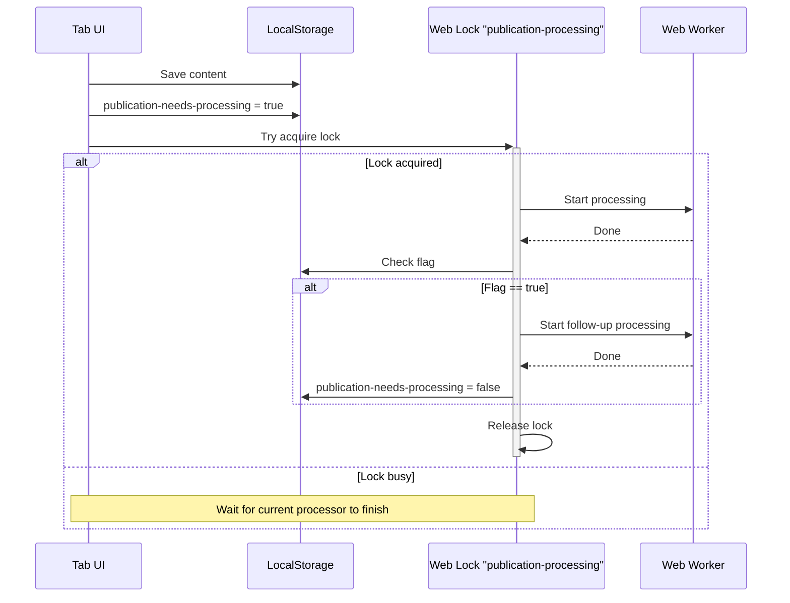

# React + TypeScript + Vite

This template provides a minimal setup to get React working in Vite with HMR and some ESLint rules.

Currently, two official plugins are available:

- [@vitejs/plugin-react](https://github.com/vitejs/vite-plugin-react/blob/main/packages/plugin-react) uses [Oxc](https://oxc.rs)
- [@vitejs/plugin-react-swc](https://github.com/vitejs/vite-plugin-react/blob/main/packages/plugin-react-swc) uses [SWC](https://swc.rs/)

## React Compiler

The React Compiler is not enabled on this template because of its impact on dev & build performances. To add it, see [this documentation](https://react.dev/learn/react-compiler/installation).

## Expanding the ESLint configuration

If you are developing a production application, we recommend updating the configuration to enable type-aware lint rules:

```js
export default defineConfig([
  globalIgnores(['dist']),
  {
    files: ['**/*.{ts,tsx}'],
    extends: [
      // Other configs...

      // Remove tseslint.configs.recommended and replace with this
      tseslint.configs.recommendedTypeChecked,
      // Alternatively, use this for stricter rules
      tseslint.configs.strictTypeChecked,
      // Optionally, add this for stylistic rules
      tseslint.configs.stylisticTypeChecked,

      // Other configs...
    ],
    languageOptions: {
      parserOptions: {
        project: ['./tsconfig.node.json', './tsconfig.app.json'],
        tsconfigRootDir: import.meta.dirname,
      },
      // other options...
    },
  },
])
```

You can also install [eslint-plugin-react-x](https://github.com/Rel1cx/eslint-react/tree/main/packages/plugins/eslint-plugin-react-x) and [eslint-plugin-react-dom](https://github.com/Rel1cx/eslint-react/tree/main/packages/plugins/eslint-plugin-react-dom) for React-specific lint rules:

```js
// eslint.config.js
import reactX from 'eslint-plugin-react-x'
import reactDom from 'eslint-plugin-react-dom'

export default defineConfig([
  globalIgnores(['dist']),
  {
    files: ['**/*.{ts,tsx}'],
    extends: [
      // Other configs...
      // Enable lint rules for React
      reactX.configs['recommended-typescript'],
      // Enable lint rules for React DOM
      reactDom.configs.recommended,
    ],
    languageOptions: {
      parserOptions: {
        project: ['./tsconfig.node.json', './tsconfig.app.json'],
        tsconfigRootDir: import.meta.dirname,
      },
      // other options...
    },
  },
])
```


## Skills

npx skills add https://github.com/sickn33/antigravity-awesome-skills --skill senior-frontend
npx skills add https://github.com/sickn33/antigravity-awesome-skills --skill react-patterns
npx skills add https://github.com/sickn33/antigravity-awesome-skills --skill typescript-expert
npx skills add https://github.com/sickn33/antigravity-awesome-skills --skill frontend-dev-guidelines 

## Decoupled Saving and Processing Queue Design

To optimize responsiveness, file saves are decoupled from publication processing. Saves write immediately to disk, while processing is delegated to a background Web Worker and managed via a cross-tab queue (needs-processing flag) coordinated by browser-native Web Locks:


 
# Storage

There are four documents that store data as markdown files. 
They are all located in the `root` directory, read on startup and written on "SAVE".

There is one JSON document that is created from the four markdown files. 
It lives in memory and is saved for debugging purposes, along with costs amd logs.

Sources, can be edited in the UI, but only used to generate publication on SAVE.

story.md
style.md
characters.md
instructions.md

## story.md

This is the main story content. It contains a number of paragraphs that are turned into prompts for drawing generation.

If there are titles, then if one level they are page titles.
If two level they are chapter and page titles.
If three levels then story, chapter and page titles.
Otherwise all paragraphs sit in chapter 1 page 1.


```md
# Story Title

## Chapter Title


### Page Title


paragraph text 

paragraph text 

paragraph text 

```

## style.md

This contains the drawing instructions for the LLM.

We can also take an image and ask for LLM drawing instructions based on that image.  
If we add that to the reference style section, it will be used when generating images.

```md
# Drawing Instructions

instructions text

# Reference Url
url to local storage image file.  

# Reference Style

LLM drawing instructions based on the image.

```

## characters.md

TO BE DEFINED


## instructions.md

TO BE DEFINED


## publication.json
  
The JSON document   contains this zod structure, 

```ts
const Publication = z.object({
  story: z.object(Story),
  style: z.string(),
  characters: z.string(),
  instructionsText: z.string(),
  panels: z.array(Panel),
})

const Story = z.object({
  storyTitle: z.string(),
  chapters: z.array(Chapter),
})

const Chapter = z.object({
  chapterTitle: z.string(),
  chapterSummary: z.string(),
  pages: z.array(Page),
})

const Page = z.object({
  pageTitle: z.string(),
  pageSummary: z.string(),
  paragraphs: z.array(Paragraph),
})

const Paragraph = z.object({
  order: z.number(),
  paragraphText: z.string(),
  priorText: z.string(),
})

const Style = z.object({
  drawingInstructions: z.string(),
  panelPerParagraph: z.boolean().default(true),
  referenceUrl: z.string().optional(),
  referenceInstructions: z.string().optional(),
  useReferenceStyle: z.boolean().default(false),
})


const Panel = z.object({
  order: z.number(),
  sceneText: z.string(),
  narrativeText: z.string(),
  panels: z.array(Image),
})

const Image = z.object({
  digest: z.string(),
  prompt: z.object(Prompt),
  
})

const Prompt = z.object({
  digest: z.string(),
  
})
```