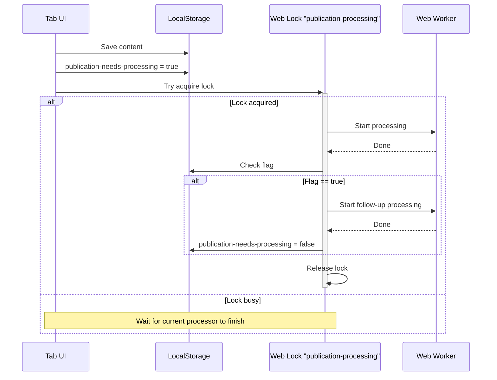

# React + TypeScript + Vite

This template provides a minimal setup to get React working in Vite with HMR and some ESLint rules.

Currently, two official plugins are available:

- [@vitejs/plugin-react](https://github.com/vitejs/vite-plugin-react/blob/main/packages/plugin-react) uses [Oxc](https://oxc.rs)
- [@vitejs/plugin-react-swc](https://github.com/vitejs/vite-plugin-react/blob/main/packages/plugin-react-swc) uses [SWC](https://swc.rs/)

## React Compiler

The React Compiler is not enabled on this template because of its impact on dev & build performances. To add it, see [this documentation](https://react.dev/learn/react-compiler/installation).

## Expanding the ESLint configuration

If you are developing a production application, we recommend updating the configuration to enable type-aware lint rules:

```js
export default defineConfig([
  globalIgnores(['dist']),
  {
    files: ['**/*.{ts,tsx}'],
    extends: [
      // Other configs...

      // Remove tseslint.configs.recommended and replace with this
      tseslint.configs.recommendedTypeChecked,
      // Alternatively, use this for stricter rules
      tseslint.configs.strictTypeChecked,
      // Optionally, add this for stylistic rules
      tseslint.configs.stylisticTypeChecked,

      // Other configs...
    ],
    languageOptions: {
      parserOptions: {
        project: ['./tsconfig.node.json', './tsconfig.app.json'],
        tsconfigRootDir: import.meta.dirname,
      },
      // other options...
    },
  },
])
```

You can also install [eslint-plugin-react-x](https://github.com/Rel1cx/eslint-react/tree/main/packages/plugins/eslint-plugin-react-x) and [eslint-plugin-react-dom](https://github.com/Rel1cx/eslint-react/tree/main/packages/plugins/eslint-plugin-react-dom) for React-specific lint rules:

```js
// eslint.config.js
import reactX from 'eslint-plugin-react-x'
import reactDom from 'eslint-plugin-react-dom'

export default defineConfig([
  globalIgnores(['dist']),
  {
    files: ['**/*.{ts,tsx}'],
    extends: [
      // Other configs...
      // Enable lint rules for React
      reactX.configs['recommended-typescript'],
      // Enable lint rules for React DOM
      reactDom.configs.recommended,
    ],
    languageOptions: {
      parserOptions: {
        project: ['./tsconfig.node.json', './tsconfig.app.json'],
        tsconfigRootDir: import.meta.dirname,
      },
      // other options...
    },
  },
])
```


## Skills

npx skills add https://github.com/sickn33/antigravity-awesome-skills --skill senior-frontend
npx skills add https://github.com/sickn33/antigravity-awesome-skills --skill react-patterns
npx skills add https://github.com/sickn33/antigravity-awesome-skills --skill typescript-expert
npx skills add https://github.com/sickn33/antigravity-awesome-skills --skill frontend-dev-guidelines 

## Decoupled Saving and Processing Queue Design

To optimize responsiveness, file saves are decoupled from publication processing. Saves write immediately to disk, while processing is delegated to a background Web Worker and managed via a cross-tab queue (needs-processing flag) coordinated by browser-native Web Locks:


 
# Storage

There are four documents that store data as markdown files. 
They are all located in the `root` directory, read on startup and written on "SAVE".

There is one JSON document that is created from the four markdown files. 
It lives in memory and is saved for debugging purposes, along with costs amd logs.

Sources, can be edited in the UI, but only used to generate publication on SAVE.

story.md
style.md
characters.md
instructions.md

## story.md

This is the main story content. It contains a number of paragraphs that are turned into prompts for drawing generation.

If there are titles, then if one level they are page titles.
If two level they are chapter and page titles.
If three levels then story, chapter and page titles.
Otherwise all paragraphs sit in chapter 1 page 1.


```md
# Story Title

## Chapter Title


### Page Title


paragraph text 

paragraph text 

paragraph text 

```

## style.md

This contains the drawing instructions for the LLM.

We can also take an image and ask for LLM drawing instructions based on that image.  
If we add that to the reference style section, it will be used when generating images.

```md
# Drawing Instructions

instructions text

# Reference Url
url to local storage image file.  

# Reference Style

LLM drawing instructions based on the image.

```

## characters.md

TO BE DEFINED


## instructions.md

These are per panel instructions, they can do the following

select which characters are in the picture. If a character is in the picture, include its character instructions.

## Character Instructions

The scene contains the following characters, please use these instructions when drawing the scene:

They should be added to the prompt here.

```text
<character-text>
{{CHARACTER-TEXT}}
</character-text>
```

On save page the instructions.md should be written.

The instructions also contains any free form cinotogramic text used to guide the drawing, such as remove this figure, redraw the window as it does not look right. Lighting or camera position instructions.

It should be inserted in to the prompt after the drawing instructions.

```text
<cinematographic-text>
{{CINEMATOGRAPHIC-TEXT}}
</cinematographic-text>
```


## publication.json
  
The JSON document   contains this zod structure, 

```ts
const Publication = z.object({
  story: z.object(Story),
  styleText: z.string(),
  characters: z.string(),
  instructionsText: z.string(),
  panels: z.array(Panel),
})

const Story = z.object({
  storyTitle: z.string(),
  chapters: z.array(Chapter),
})

const Chapter = z.object({
  chapterTitle: z.string(),
  chapterText: z.string().optional(),,
  chapterSummary: z.string(),
  pages: z.array(Page),
})

const Page = z.object({
  pageTitle: z.string(),
  pageText: z.string(),
  pageSummary: z.string().optional(),
  paragraphs: z.array(Paragraph),
})

const Paragraph = z.object({
  order: z.number(),
  paragraphText: z.string(),
  priorText: z.string(),
  priorSummary: z.string(),
})

const Style = z.object({
  drawingInstructions: z.string(),
  panelPerParagraph: z.boolean().default(true),
  referenceUrl: z.string().optional(),
  referenceInstructions: z.string().optional(),
  useReferenceStyle: z.boolean().default(false),
})


const Panel = z.object({
  order: z.number(),
  sceneText: z.string(),
  narrativeText: z.string(),
  panels: z.array(Image),
})

const Image = z.object({
  digest: z.string(),
  prompt: z.object(Prompt),
  
})

const Prompt = z.object({
  digest: z.string(),
  
})
```

## Processing and Saving

Processing takes time, so it must not be done in the UI.

On "SAVE", the four markdown files are saved, and the publication is generated, any LLM calls are queued for processing.

STEPS TO CREATE PUBLICATION

1. Split the story.md into chapters, pages and paragraphs.
2. For each paragraph, create a priorText for all text on a page before that paragraph.
3. For each page, create a pageSummary for all text on a page.
4. For each chapter, create a chapterSummary for all text in a chapter.
5. For all chapterText, pageText and priorText, if larger than const MAX_SUMMARY_CHARACTERS = 500, use an LLM to summaries the text into xxxSummary. Batch together the summarization for efficiency.
6. Generate a panel per paragraph or sceneText is the paragraphText or pageText, narrativeText is prior chapters summaries or texts, prior pages summaries or texts and the priorText if it is per paragraph. 
7. publication.styleText comes from style.md - Drawing Instructions.


## Prompt

<xxx> use data in publication.json when constructing the prompt

 ```md
 # Role
You are an illustrator for a book.
Please draw an illustration for the scene-text bellow.
The narrative-text lays out the story before the current scene, and the scene-text is the current scene.


## Drawing Instructions

<style-text>
</style-text>

### Strict Rules
1. A wide-angle, edge-to-edge scene that completely fills 100% of the image space from corner to corner.
2. The camera is pulled back so the environment extends fully to the very edges of the rectangular canvas.
3. Keep the background in focus, and of the same style as the foreground object.
4. Do not illustrate any words, signs, or speech bubbles unless specifically asked for in the text.
5. Do not make any illustration with rounded edges; the completed illustration should be a rectangle.
6. Do not draw any frame, boundary, or any decoration around the image.
7. Do not draw any text in the image.
8. Do not use copyright symbols (©, ™, ®) or any other markings in the illustration.

### Output Format
1. The illustration is to fill the complete drawing area.
2. Do not make any illustration with rounded edges; the completed illustration should be a rectangle.
3. Do not draw any frame, boundary, or any decoration around the image (i.e., fameless, full-bleed, no white margins, edge-to-edge environment). 
4. Keep the background in focus and of the same style as the foreground. Do not make the background blurry or out of focus. The background should be as detailed as the foreground.
5. Do not draw any text in the image. 
6. Do not use copyright symbols (©, ™, ®) or any other markings in the illustration.

## Scene Instructions

<scene-text>
</scene-text>

<narrative-text>
</narrative-text>
 ```


STEP 1 : Read story.md and generate 


we will have the following stores in indexDB

story (only one entry)
style (only one entry)
characters (many entries)
instructions (many entries)
prompts (many entries)
summaries (many entries)

on disk a story will be stored in /story.md
on disk a style will be stored in /style.md
on disk a characters list will be stored in /characters.md
on disk a instructions list will be stored in /instructions.md

on disk a prompt is stored in prompts/digest.md
on disk a image from a prompt will be stored in images/digest.png
on disk a summary is stored in summaries/digest.md


story = {
  title: 'STRING',
  chapters: [
    {
      chapterNo: 0,
      chapterTitle: 'STRING',
      chapterText: 'STRING',
      chapterSummary: 'STRING',
      chapterDigest: 'STRING',
      pages: [
        {
          pageNo: 0,
          pageTitle: 'STRING',
          pageText: 'STRING',
          pageSummary: 'STRING',
          pageDigest: 'STRING',
          paragraphs: [
            {
              paragraphNo: 0,
              paragraphText: 'STRING',
              priorText: 'STRING',
              narrativeText: 'STRING',
              narrativeDigest: 'STRING',
            }
          ]
        }
      ]
    }
  ]
}


style = {
  "drawingInstructions": "string",
  "panelPerParagraph": true,
  "referenceUrl": "string",
  "referenceInstructions": "string",
  "useReferenceInstructions": true
}

characters = [{
    "characterNo": 0
    "characterName": "STRING",
    "referenceUrl": "string",
    "descriptionText": "STRING",
    "instructionsText": "STRING",
}]

summaries = [{
      summaryId: 0,
      digest: "STRING"
      summaryText:"STRING"
}]

instructions = [{
  instructionNo: 0,
      paragraphId: 0
      pageId: 0
      chapterId: 0
      imageIndex: 0,
      cinematographicDirections: "STRING",
      characters: ["NAME", "NAME"],
      images: [{
        status: "PROCESSING | COMPLETE | FAILED"

        styleText: "STRING"
        cinematographicText: "STRING"
        characterText: "STRING"
        sceneText: "STRING",
        narrativeText: "STRING", 
        
        promptDigest:"STRING"
      }]
}]


loadStartup : loads story, style, instructions, characters from disk into main thread stores and into indexDB

saveStory : saves story text to story.md and replaces the story in indexDB can replace whole story or just a chapter or a page. runs generateSummaries before saving
saveStyle : saves style text to style.md and replaces the style in indexDB
saveCharacters : saves characters text to characters.md and replaces the characters in indexDB
saveInstructions : saves instructions text to instructions.md and replaces the instructions in indexDB

all saves trigger processImages
 
/workflows/generateSummaries : takes story summaries for each paragraph, page and chapter
/workflows/processImages : takes story, style, characters, instructions and generates prompts and images for each panel  

