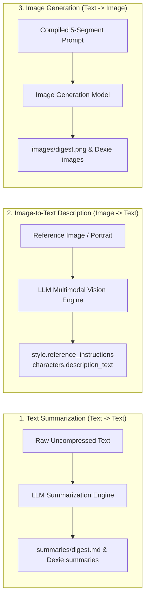
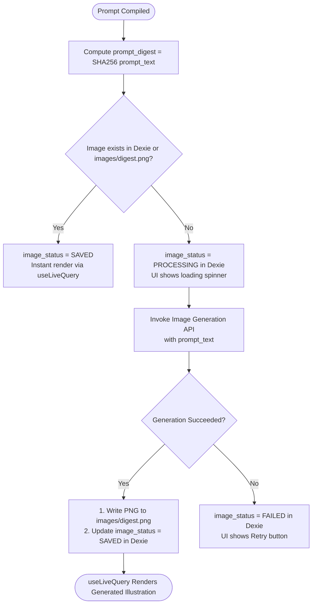

# WriteToSee LLM Interactions Specification

## Purpose & Overview

This document specifies the three core **LLM Interaction Workflows** in the WriteToSee standalone application:
1. **Text Summarization** (`text -> text`): Condensing long narrative text into cached summaries.
2. **Image-to-Text Description** (`image -> text`): Vision model analysis of style reference portraits and character visual traits.
3. **Image Generation** (`text -> image`): Generating scene illustration panels from compiled prompts.

All interactions are deterministic, cache-backed, and integrate directly with Dexie IndexedDB and the local File System Access API.



---

## 1. Interaction 1: Text Summarization (`text -> text`)

### Purpose
Reduces long narrative text across the story hierarchy when it exceeds specific word thresholds to fit within LLM context windows while preserving plot, mood, character actions, and visual cues.

### Invocation Triggers & Thresholds
*   **Story Summary** (`story.story_summary`): Triggered when `story_text` > 1500 words $\rightarrow$ compressed to maximum 400 words.
*   **Chapter Summary** (`chapters.chapter_summary`): Triggered when `chapter_text` > 500 words $\rightarrow$ compressed to maximum 250 words.
*   **Page Summary** (`pages.page_summary`): Triggered when `page_text` > 100 words $\rightarrow$ compressed to maximum 100 words.
*   **Narrative Context** (`paragraphs.narrative_summary`): Triggered when preceding context (`preceding_text + prior_text`) > 500 words $\rightarrow$ compressed to maximum 250 words.

### Cache Protocol
1. Compute `summary_digest = SHA256(raw_uncompressed_text)`.
2. Check Dexie `processDb.summaries.get(summary_digest)` / disk `summaries/{summary_digest}.md`.
3. If cache hit $\rightarrow$ return cached `summary_text` (zero LLM calls).
4. If cache miss $\rightarrow$ call LLM Summarization API $\rightarrow$ store in Dexie and write to `summaries/{summary_digest}.md`.

### LLM Prompt Template
```markdown
You are an expert literary editor specializing in narrative compression for visual storytelling.

Summarize the following text in under {{MAX_WORDS}} words.
Preserve all key character names, core plot events, setting details, character emotions, and visual actions.
Do not include meta commentary or introductory filler. Output ONLY the compressed narrative summary.

Source Text:
"""
{{SOURCE_TEXT}}
"""
```

### Input & Output Schema
*   **Input**:
    ```typescript
    interface SummarizationRequest {
      sourceText: string;
      maxWords: number;
      entityType: 'story' | 'chapter' | 'page' | 'paragraph';
    }
    ```
*   **Output**:
    ```typescript
    interface SummarizationResponse {
      summaryDigest: string; // SHA256 of sourceText
      summaryText: string;   // LLM-generated summary
    }
    ```

---

## 2. Interaction 2: Image-to-Text Description / Visual Analysis (`image -> text`)

### Purpose
Analyzes visual reference images (such as artist style sample images in `style.md` or character portraits in `characters.md`) using multimodal vision models to extract structured visual descriptors and prompt modifiers.

### Use Cases & Modes:
1. **Style Reference Extraction (`style.reference_instructions`)**:
   - Analyzes an artist reference painting, photo, or drawing.
   - Extracts artistic medium (e.g. oil painting, digital cel-shading, gouache), lighting setup, color palette, brush texture, rendering style, and overall visual mood.
2. **Character Portrait Extraction (`characters.description_text` & `instructions_text`)**:
   - Analyzes a character reference photo or concept portrait.
   - Extracts facial features, eye color, hair style/color, age, physique, distinctive clothing, accessories, and rendering directives.

### LLM Vision Prompt Templates

#### Mode A: Style Reference Analysis
```markdown
You are a master art director and visual style analyst.

Analyze the attached reference image in detail. Extract a concise, dense prompt modifier describing:
1. Artistic Medium (e.g. digital concept art, oil on canvas, 35mm film photograph, watercolor)
2. Lighting & Atmosphere (e.g. volumetric lighting, golden hour, moody shadows, rim lighting)
3. Color Palette & Tone (e.g. warm earth tones, neon cyberpunk, pastel hues, desaturated noir)
4. Rendering Quality & Texture (e.g. visible brush strokes, fine linework, hyper-detailed textures)

Output ONLY the prompt modifier text suitable for appending to image generation prompts.
```

#### Mode B: Character Reference Analysis
```markdown
You are a character design and visual consistency director.

Analyze the character in the attached reference portrait and provide two sections:
1. Description: Exact physical traits, estimated age, facial structure, eye color, hair color and style, skin tone, clothing, and distinctive markings.
2. Directives: Specific rendering instructions for ensuring this character looks identical across multiple scenes.

Output format:
DESCRIPTION: <concise visual traits>
DIRECTIVES: <rendering instructions>
```

### Input & Output Schema
*   **Input**:
    ```typescript
    interface VisionAnalysisRequest {
      imageFile: Blob | File;
      analysisMode: 'style_reference' | 'character_portrait';
    }
    ```
*   **Output**:
    ```typescript
    interface VisionAnalysisResponse {
      referenceInstructions?: string; // For style analysis
      descriptionText?: string;       // For character analysis
      instructionsText?: string;      // For character directives
    }
    ```

---

## 3. Interaction 3: Image Generation (`text -> image`)

### Purpose
Generates high-resolution scene illustrations for each illustrated panel based on the compiled 5-segment prompt.

### Prompt Assembly Structure
Every prompt is assembled from 5 distinct segments wrapped in the standard book illustration prompt template:

```markdown
# Role
You are an illustrator for a book.
Please draw an illustration for the scene-text bellow.
The narrative-text lays out the story before the current scene, and the scene-text is the current scene.


## Drawing Instructions

<style-text>
{{STYLE_TEXT}}
</style-text>

### Strict Rules
1. A wide-angle, edge-to-edge scene that completely fills 100% of the image space from corner to corner.
2. The camera is pulled back so the environment extends fully to the very edges of the rectangular canvas.
3. Keep the background in focus, and of the same style as the foreground object.
4. Do not illustrate any words, signs, or speech bubbles unless specifically asked for in the text.
5. Do not make any illustration with rounded edges; the completed illustration should be a rectangle.
6. Do not draw any frame, boundary, or any decoration around the image.
7. Do not draw any text in the image.
8. Do not use copyright symbols (©, ™, ®) or any other markings in the illustration.

### Output Format
1. The illustration is to fill the complete drawing area.
2. Do not make any illustration with rounded edges; the completed illustration should be a rectangle.
3. Do not draw any frame, boundary, or any decoration around the image (i.e., fameless, full-bleed, no white margins, edge-to-edge environment). 
4. Keep the background in focus and of the same style as the foreground. Do not make the background blurry or out of focus. The background should be as detailed as the foreground.
5. Do not draw any text in the image. 
6. Do not use copyright symbols (©, ™, ®) or any other markings in the illustration.

<cinematographic-text>
{{CINEMATOGRAPHIC_TEXT}}
</cinematographic-text>

## Character Instructions

The scene contains the following characters, please use these instructions when drawing the scene:

<character-text>
{{CHARACTER_TEXT}}
</character-text>

## Scene Instructions

<scene-text>
{{SCENE_TEXT}}
</scene-text>

<narrative-text>
{{NARRATIVE_TEXT}}
</narrative-text>
```

#### Segments Definition:
1. **`style_text`**: Global drawing medium, lighting rules, and reference style modifiers from `style` table.
2. **`cinematographic_text`**: Camera angle (e.g. wide establishing shot, low-angle close up), framing, and scene mood from `instructions.cinematographic_directions`.
3. **`character_text`**: Visual traits and rendering directives for all characters present in `instructions.assigned_characters`.
4. **`narrative_text`**: Compressed preceding story context from `paragraphs.narrative_summary`.
5. **`scene_text`**: The immediate paragraph narrative sentence from `paragraphs.paragraph_text`.

### Cache & Generation Lifecycle


### Input & Output Schema
*   **Input**:
    ```typescript
    interface ImageGenerationRequest {
      promptDigest: string; // SHA256(promptText)
      promptText: string;   // 5-segment compiled prompt
      dimensions?: { width: number; height: number }; // Default 1024x1024 or 16:9
    }
    ```
*   **Output**:
    ```typescript
    interface ImageGenerationResponse {
      imageDigest: string;
      imageBlob: Blob;     // PNG binary data written to disk
      imageStatus: 'SAVED' | 'FAILED';
      createdAt: Date;
    }
    ```

---

## 4. Interaction Summary & Protocol Matrix

| Interaction | Direction | Input | Output | Storage Artifact | Dexie Table | Cache Key |
| :--- | :--- | :--- | :--- | :--- | :--- | :--- |
| **1. Text Summarization** | Text $\rightarrow$ Text | `source_text`, `max_words` | `summary_text` | `summaries/{digest}.md` | `summaries` | `SHA256(source_text)` |
| **2. Visual Description** | Image $\rightarrow$ Text | Reference Image Blob | `reference_instructions`<br>`description_text` | `style.md`<br>`characters.md` | `style`<br>`characters` | File Hash / URL |
| **3. Image Generation** | Text $\rightarrow$ Image | `prompt_text` (5 segments) | PNG Image Binary | `images/{digest}.png` | `images` | `SHA256(prompt_text)` |
