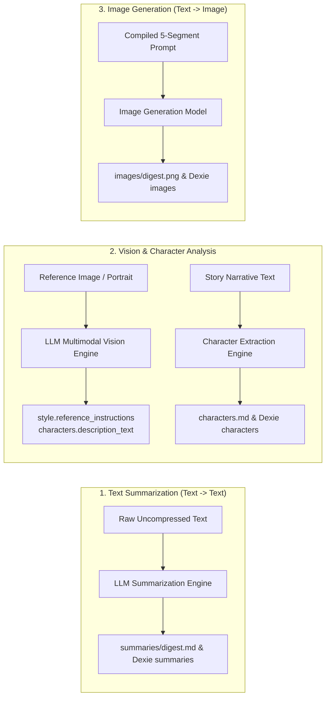

# WriteToSee LLM Interactions Specification

## Purpose & Overview

This document specifies the core **LLM Interaction Workflows** and **Prompt Templates** in the WriteToSee standalone application:
1. **Text Summarization** (`text -> text`): Condensing long narrative text into cached summaries.
2. **Image-to-Text Description & Visual Analysis** (`image -> text`): Vision model analysis of style reference portraits and character visual traits.
3. **Character Extraction & Literary Analysis** (`text -> text` / `text -> JSON`): Extracting character rosters from story text and enriching character backstories.
4. **Image Generation** (`text -> image`): Generating scene illustration panels from compiled 5-segment prompts.

All interactions are deterministic, cache-backed, and integrate directly with Dexie IndexedDB and the local File System Access API.



---

## Prompt Template Architectural Standards (`src/data/llm/prompts/`)

All LLM prompts in the application strictly adhere to the following architecture:
1. **One Prompt Per File**: Every individual prompt template (system prompt or user prompt template) resides in its own dedicated TypeScript file.
2. **`verbNoun` Naming Standard**: File names and builder function names follow the `verbNoun` convention starting with a verb (e.g. `createBookIllustrationPrompt`, `createExtractCharactersSystemPrompt`, `createExtractCharactersUserPrompt`).
3. **Role Header Requirement**: Every system prompt template begins with an explicit `# Role` header clearly defining the model's persona and objective.
4. **Direct File Imports**: Files must be imported directly from their specific module path (e.g. `import { createBookIllustrationPrompt } from '@/data/llm/prompts/createBookIllustrationPrompt'`). No `index.ts` barrel files are used.
5. **Mustache Placeholders**: Dynamic prompt values use standard Mustache tag notation (e.g. `{{STYLE_TEXT}}`, `{{CHARACTER_NAME}}`, `{{STORY_TEXT}}`).

---

## 1. Interaction 1: Text Summarization (`text -> text`)

### Purpose
Reduces long narrative text across the story hierarchy when it exceeds specific word thresholds to fit within LLM context windows while preserving plot, mood, character actions, and visual cues.

### Invocation Triggers & Thresholds
*   **Story Summary** (`story.story_summary`): Triggered when `story_text` > 1500 words $\rightarrow$ compressed to maximum 400 words.
*   **Chapter Summary** (`chapters.chapter_summary`): Triggered when `chapter_text` > 500 words $\rightarrow$ compressed to maximum 250 words.
*   **Page Summary** (`pages.page_summary`): Triggered when `page_text` > 100 words $\rightarrow$ compressed to maximum 100 words.
*   **Narrative Context** (`paragraphs.narrative_summary`): Triggered when preceding context (`preceding_text + prior_text`) > 500 words $\rightarrow$ compressed to maximum 150 words.

### Cache Protocol
1. Compute `summary_digest = SHA256(raw_uncompressed_text)`.
2. Check Dexie `processDb.summaries.get(summary_digest)` / disk `summaries/{summary_digest}.md`.
3. If cache hit $\rightarrow$ return cached `summary_text` (zero LLM calls).
4. If cache miss $\rightarrow$ call LLM Summarization API $\rightarrow$ store in Dexie and write to `summaries/{summary_digest}.md`.

### Prompt Files & Templates

#### System Prompt: [`src/data/llm/prompts/createGenerateSummarySystemPrompt.ts`](file:///home/daniel/Data/GitHub/writetosee/writetosee-standalone-vite/src/data/llm/prompts/createGenerateSummarySystemPrompt.ts)
*   **Function**: `createGenerateSummarySystemPrompt(contextType?: string, maxWords?: number): string`
*   **Template**:
    ```mustache
    # Role
    You are an expert literary and narrative summarizer for illustrated book scenes.
    Analyze the provided {{CONTEXT_TYPE}} text and generate a concise, high-level narrative summary designed to provide visual and story continuity for subsequent scene illustrations.

    Guidelines:
    1. Maximum length: strictly no more than {{MAX_WORDS}} words.
    2. Focus on physical environment & setting, active characters present, key narrative actions, and the immediate state of the scene.
    3. Prioritize concrete situational progression over abstract thematic commentary.
    4. Output ONLY the plain summary text. Do NOT add titles, headers, bullet points, or commentary wrappers.
    ```

#### User Prompt: [`src/data/llm/prompts/createGenerateSummaryUserPrompt.ts`](file:///home/daniel/Data/GitHub/writetosee/writetosee-standalone-vite/src/data/llm/prompts/createGenerateSummaryUserPrompt.ts)
*   **Function**: `createGenerateSummaryUserPrompt(textToSummarize: string): string`
*   **Template**:
    ```mustache
    <text-to-summarize>
    {{TEXT_TO_SUMMARIZE}}
    </text-to-summarize>
    ```

---

### Mode A: Style Reference Vision Analysis (`image -> text`)
Analyzes an artist reference painting, photo, or drawing to extract artistic medium, lighting setup, color palette, brush texture, rendering style, and overall visual mood for `style.reference_instructions`.

*   **Prompt File**: [`src/data/llm/prompts/createStyleReferencePrompt.ts`](file:///home/daniel/Data/GitHub/writetosee/writetosee-standalone-vite/src/data/llm/prompts/createStyleReferencePrompt.ts)
    *   **Function**: `createStyleReferencePrompt(): string`
    *   **Template**:
        ```text
        # Role
        You are a professional art director and visual style analyst for AI image generation.
        Analyze the style reference image provided. Generate a precise, detailed list of drawing instructions that capture its artistic style, medium, coloring, lighting, composition, mood, and characters.

        Guidelines:
        1. Focus on 5 key visual dimensions: Artistic Medium & Technique, Color Palette & Harmony, Lighting & Atmosphere, Linework & Surface Texture, and Compositional Framing.
        2. Each sentence should be a dense, clear descriptive instruction suitable for appending directly to an image generation prompt.
        3. Do NOT use introductory filler (e.g. "The image depicts...").
        4. Do NOT use markdown headers, bullet points (like -, *, or numbers), or lists in your output.
        5. Return ONLY the description sentences, with each sentence on its own separate line.
        6. Output 5 to 8 lines.
        ```

---

### Mode B: Extract Characters from Story (`text -> JSON`)
Parses story text to extract up to 10 key character entities and their visual appearance summaries into structured JSON.

*   **System Prompt**: [`src/data/llm/prompts/createExtractCharactersSystemPrompt.ts`](file:///home/daniel/Data/GitHub/writetosee/writetosee-standalone-vite/src/data/llm/prompts/createExtractCharactersSystemPrompt.ts)
    *   **Function**: `createExtractCharactersSystemPrompt(): string`
    *   **Template**:
        ```text
        # Role
        You are an expert literary analyst and character extractor.
        Your task is to analyze the story text provided by the user and extract all key characters.

        Strict Constraints:
        1. Extract at most 10 characters (maximum of 10 characters).
        2. Canonical Names: Use the character's primary recognizable name. Merge aliases, nicknames, and titles into a single canonical entry.
        3. For each character, provide a "name" and a clear, descriptive summary ("description") covering their physical appearance, facial features, hair/eye color, estimated age, clothing style, and role in the story.
        4. Return ONLY a valid JSON array of character objects with keys "name" and "description".
        5. Do NOT include markdown code blocks, backticks, fences, or introductory text.

        Example format:
        [
          {"name": "Alice", "description": "A curious 10-year-old girl with blonde hair, bright blue eyes, wearing a blue knee-length dress with a white apron who explores Wonderland."},
          {"name": "White Rabbit", "description": "An anthropomorphic, waistcoat-wearing white rabbit with pink eyes and a pocket watch who is always running late."}
        ]
        ```
*   **User Prompt**: [`src/data/llm/prompts/createExtractCharactersUserPrompt.ts`](file:///home/daniel/Data/GitHub/writetosee/writetosee-standalone-vite/src/data/llm/prompts/createExtractCharactersUserPrompt.ts)
    *   **Function**: `createExtractCharactersUserPrompt({ storyText }): string`
    *   **Template**:
        ```mustache
        <story>
        {{STORY_TEXT}}
        </story>
        ```

---

### Mode C: Analyze Character Story (`text -> text`)
Analyzes full story text for a specific character to build rich physical and personality descriptions (`characters.description_text`).

*   **System Prompt**: [`src/data/llm/prompts/createAnalyzeCharacterStorySystemPrompt.ts`](file:///home/daniel/Data/GitHub/writetosee/writetosee-standalone-vite/src/data/llm/prompts/createAnalyzeCharacterStorySystemPrompt.ts)
    *   **Function**: `createAnalyzeCharacterStorySystemPrompt(characterName: string): string`
    *   **Template**:
        ```mustache
        # Role
        You are an expert literary character analyst.
        Your task is to analyze the provided story text and generate a detailed, rich, comprehensive character description for the character named "{{CHARACTER_NAME}}".

        Guidelines:
        1. Synthesize existing description details with newly discovered story context.
        2. Focus on concrete visual attributes: physical build, facial features, skin tone, eye color/shape, hair style/color, estimated age, signature wardrobe/accessories, and characteristic postures.
        3. Highlight key personality traits, emotional disposition, and their narrative role in the story.
        4. Return ONLY the description text. Do not include markdown headers, bullet lists, or commentary wrapper tags.
        ```
*   **User Prompt**: [`src/data/llm/prompts/createAnalyzeCharacterStoryUserPrompt.ts`](file:///home/daniel/Data/GitHub/writetosee/writetosee-standalone-vite/src/data/llm/prompts/createAnalyzeCharacterStoryUserPrompt.ts)
    *   **Function**: `createAnalyzeCharacterStoryUserPrompt({ characterName, currentDescription, storyText }): string`
    *   **Template**:
        ```mustache
        <character-name>{{CHARACTER_NAME}}</character-name>
        <current-description>{{CURRENT_DESCRIPTION}}</current-description>
        <story>
        {{STORY_TEXT}}
        </story>
        ```

---

### Mode D: Analyze Character Reference Image (`image -> text`)
Analyzes character reference images or cropped face/body regions to extract consistent illustration drawing directives (`characters.instructions_text`).

*   **System Prompt**: [`src/data/llm/prompts/createAnalyzeCharacterImageSystemPrompt.ts`](file:///home/daniel/Data/GitHub/writetosee/writetosee-standalone-vite/src/data/llm/prompts/createAnalyzeCharacterImageSystemPrompt.ts)
    *   **Function**: `createAnalyzeCharacterImageSystemPrompt(characterName: string): string`
    *   **Template**:
        ```mustache
        # Role
        You are an expert visual artist and character illustrator.
        Analyze the provided image of the character "{{CHARACTER_NAME}}".
        Generate precise, highly detailed step-by-step drawing instructions to ensure consistent visual depiction of this character across multiple illustrated scenes.

        Guidelines:
        1. Cover: Art medium/style, body proportions, facial structure & features, eye shape & exact color, hair texture/length/color, outfit & clothing materials, color palette, lighting/shadowing, and signature visual attributes.
        2. Provide exact visual descriptors (e.g. "shoulder-length wavy chestnut hair", "almond-shaped hazel eyes", "dark charcoal linen vest over a cream collared shirt").
        3. Return ONLY the drawing instructions text. Do NOT include markdown headers, bullet lists, or wrapper commentary.
        ```
*   **User Prompt**: [`src/data/llm/prompts/createAnalyzeCharacterImageUserPrompt.ts`](file:///home/daniel/Data/GitHub/writetosee/writetosee-standalone-vite/src/data/llm/prompts/createAnalyzeCharacterImageUserPrompt.ts)
    *   **Function**: `createAnalyzeCharacterImageUserPrompt(characterName: string): string`
    *   **Template**:
        ```mustache
        Analyze the character picture for "{{CHARACTER_NAME}}" and provide detailed drawing instructions.
        ```

---

## 3. Interaction 3: Image Generation (`text -> image`)

### Purpose
Generates high-resolution scene illustrations for each illustrated panel based on the compiled 5-segment prompt.

### Prompt Builder: [`src/data/llm/prompts/createBookIllustrationPrompt.ts`](file:///home/daniel/Data/GitHub/writetosee/writetosee-standalone-vite/src/data/llm/prompts/createBookIllustrationPrompt.ts)
*   **Function**: `createBookIllustrationPrompt(variables: BookIllustrationPromptVariables): string`
*   **Constant**: `BOOK_ILLUSTRATION_PROMPT_TEMPLATE`
*   **Template Structure**:
    ```mustache
    # Role
    You are a master book illustrator.
    Draw a complete, single, full-bleed illustration that visualizes the scene described in <scene-text>.
    The <narrative-text> provides preceding story context; do NOT illustrate past events from <narrative-text>.

    ## Drawing Instructions
    The following style text describes how you should draw, and the target aesthetic for the drawing:

    <style-text>
    {{STYLE_TEXT}}
    </style-text>

    <cinematographic-text>
    {{CINEMATOGRAPHIC_TEXT}}
    </cinematographic-text>

    ## Character Instructions
    The scene contains the following characters. Please follow these visual descriptions and instructions:

    <character-text>
    {{CHARACTER_TEXT}}
    </character-text>

    ## Scene Instructions
    Please draw the scene described below. Illustrate ONLY the <scene-text>.
    The narrative text is provided strictly for background context.

    <narrative-text>
    {{NARRATIVE_TEXT}}
    </narrative-text>

    <scene-text>
    {{SCENE_TEXT}}
    </scene-text>

    ## Composition & Quality Rules
    1. A single, wide-angle, edge-to-edge full-bleed scene filling 100% of the rectangular canvas from corner to corner.
    2. The camera is pulled back so the environment extends fully to the very edges without borders, frames, vignettes, or white margins.
    3. Keep the background in sharp focus and stylistically unified with the foreground.
    4. Single continuous image only: NO split panels, NO comic strip grids, NO gutters, NO collage divisions.
    5. Do NOT illustrate any words, letters, speech bubbles, signs, subtitles, watermarks, or artist signatures.
    6. Do NOT use copyright symbols (©, ™, ®) or any markings in the illustration.
    ```

#### Segments Definition:
1. **`style_text`**: Global drawing medium, lighting rules, and reference style modifiers from `style` table.
2. **`cinematographic_text`**: Camera angle, framing, and scene mood from `instructions.cinematographic_directions`.
3. **`character_text`**: Visual traits and rendering directives for all characters present in `instructions.assigned_characters`.
4. **`narrative_text`**: Compressed preceding story context from `paragraphs.narrative_summary`.
5. **`scene_text`**: The immediate paragraph narrative sentence from `paragraphs.paragraph_text`.

---

## 4. Complete Prompt & File Reference Matrix

| Interaction Mode | Prompt File | Builder Function | Mustache Variables |
| :--- | :--- | :--- | :--- |
| **Image Generation** | [`createBookIllustrationPrompt.ts`](file:///home/daniel/Data/GitHub/writetosee/writetosee-standalone-vite/src/data/llm/prompts/createBookIllustrationPrompt.ts) | `createBookIllustrationPrompt` | `{{STYLE_TEXT}}`<br>`{{CINEMATOGRAPHIC_TEXT}}`<br>`{{CHARACTER_TEXT}}`<br>`{{NARRATIVE_TEXT}}`<br>`{{SCENE_TEXT}}` |
| **Character Extraction (Sys)** | [`createExtractCharactersSystemPrompt.ts`](file:///home/daniel/Data/GitHub/writetosee/writetosee-standalone-vite/src/data/llm/prompts/createExtractCharactersSystemPrompt.ts) | `createExtractCharactersSystemPrompt` | None |
| **Character Extraction (User)** | [`createExtractCharactersUserPrompt.ts`](file:///home/daniel/Data/GitHub/writetosee/writetosee-standalone-vite/src/data/llm/prompts/createExtractCharactersUserPrompt.ts) | `createExtractCharactersUserPrompt` | `{{STORY_TEXT}}` |
| **Style Reference** | [`createStyleReferencePrompt.ts`](file:///home/daniel/Data/GitHub/writetosee/writetosee-standalone-vite/src/data/llm/prompts/createStyleReferencePrompt.ts) | `createStyleReferencePrompt` | None |
| **Character Story Analysis (Sys)** | [`createAnalyzeCharacterStorySystemPrompt.ts`](file:///home/daniel/Data/GitHub/writetosee/writetosee-standalone-vite/src/data/llm/prompts/createAnalyzeCharacterStorySystemPrompt.ts) | `createAnalyzeCharacterStorySystemPrompt` | `{{CHARACTER_NAME}}` |
| **Character Story Analysis (User)** | [`createAnalyzeCharacterStoryUserPrompt.ts`](file:///home/daniel/Data/GitHub/writetosee/writetosee-standalone-vite/src/data/llm/prompts/createAnalyzeCharacterStoryUserPrompt.ts) | `createAnalyzeCharacterStoryUserPrompt` | `{{CHARACTER_NAME}}`<br>`{{CURRENT_DESCRIPTION}}`<br>`{{STORY_TEXT}}` |
| **Character Image Analysis (Sys)** | [`createAnalyzeCharacterImageSystemPrompt.ts`](file:///home/daniel/Data/GitHub/writetosee/writetosee-standalone-vite/src/data/llm/prompts/createAnalyzeCharacterImageSystemPrompt.ts) | `createAnalyzeCharacterImageSystemPrompt` | `{{CHARACTER_NAME}}` |
| **Character Image Analysis (User)** | [`createAnalyzeCharacterImageUserPrompt.ts`](file:///home/daniel/Data/GitHub/writetosee/writetosee-standalone-vite/src/data/llm/prompts/createAnalyzeCharacterImageUserPrompt.ts) | `createAnalyzeCharacterImageUserPrompt` | `{{CHARACTER_NAME}}` |
| **Text Summarization (Sys)** | [`createGenerateSummarySystemPrompt.ts`](file:///home/daniel/Data/GitHub/writetosee/writetosee-standalone-vite/src/data/llm/prompts/createGenerateSummarySystemPrompt.ts) | `createGenerateSummarySystemPrompt` | `{{CONTEXT_TYPE}}`<br>`{{MAX_WORDS}}` |
| **Text Summarization (User)** | [`createGenerateSummaryUserPrompt.ts`](file:///home/daniel/Data/GitHub/writetosee/writetosee-standalone-vite/src/data/llm/prompts/createGenerateSummaryUserPrompt.ts) | `createGenerateSummaryUserPrompt` | `{{TEXT_TO_SUMMARIZE}}` |
