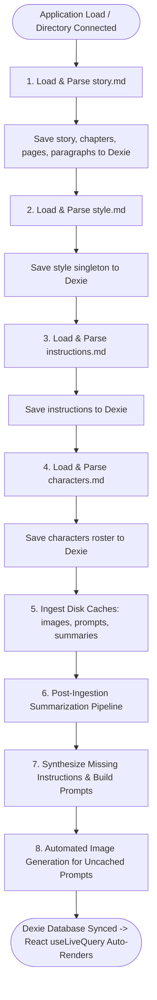
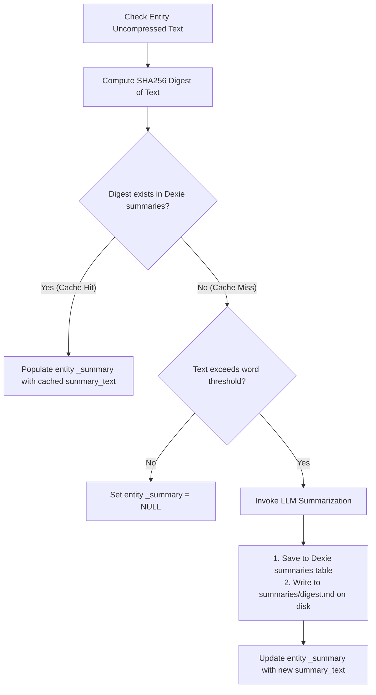
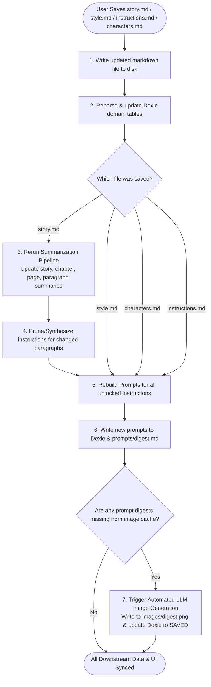

# WriteToSee Processing & Data Flow Specification

## Purpose & Architecture Overview

This document specifies the core **Data Ingestion, Asset Caching, Post-Ingestion Summarization, Prompt Compilation, LLM Image Generation, and File-Save Reactive Cascade Workflows** for the WriteToSee standalone application.

All state transitions and disk synchronizations adhere to the [Domain Model Specification](file:///home/daniel/Data/GitHub/writetosee/writetosee-standalone-vite/skills/writetosee-standalone/domain.md) and propagate deterministically through **Dexie.js IndexedDB** for domain entities and `@keldan-systems/state-mutex` for transient display state.

---

## 1. State Partitioning Architecture

*   **Domain Data:** Stored in Dexie IndexedDB tables (`story`, `chapters`, `pages`, `paragraphs`, `style`, `characters`, `instructions`, `images`, `prompts`, `summaries`). All React components subscribe to domain data using Dexie live query hooks (`useLiveQuery` from `dexie-react-hooks`).
*   **Display State:** UI layout preferences and ephemeral view options (such as `images-per-row`, active view tab, column layout density, zoom level) are managed through `@keldan-systems/state-mutex` (`useLocalState`, `useSharedState`).

---

## 2. Application Startup Ingestion Pipeline (`on application load`)

When the user opens the application and selects or reconnects the project root directory via the File System Access API, files and cache directories are read, parsed, and loaded into Dexie IndexedDB in the following sequential order:



---

### Step 1: `story.md` Ingestion & Hierarchy Construction

1. **Read File**: Read raw markdown from `story.md`.
2. **Parse Hierarchy**:
   - Parse `# Story Title` $\rightarrow$ `story` singleton (`story_id = 'main'`).
   - Parse `## Chapter Title` $\rightarrow$ `chapters` (`chapter_no`, `story_id`, `chapter_title`, `chapter_text`).
   - Parse `### Page Title` $\rightarrow$ `pages` (`page_no`, `chapter_no`, `page_title`, `page_text`).
   - Parse paragraph text blocks $\rightarrow$ `paragraphs` (`paragraph_no`, `chapter_no`, `page_no`, `paragraph_text`).
3. **Compute Preceding & Prior Contexts**:
   - `prior_text`: Accumulated paragraph text on the same page preceding each paragraph.
   - `preceding_text`: Accumulated summaries for all preceding chapters and preceding pages in the current chapter.
   - Compute deterministic SHA256 digests (`story_digest`, `chapter_digest`, `page_digest`, `narrative_digest`).
4. **Persist to Dexie**:
   - Atomically write to Dexie IndexedDB tables: `processDb.story`, `processDb.chapters`, `processDb.pages`, `processDb.paragraphs`.

---

### Step 2: `style.md` Ingestion

1. **Read File**: Read markdown content from `style.md`.
2. **Parse Directives**:
   - Extract global drawing medium and lighting rules $\rightarrow$ `drawing_instructions`.
   - Extract paragraph illustration mode $\rightarrow$ `panel_per_paragraph`.
   - Extract artist sample portrait/URL $\rightarrow$ `reference_url`.
   - Extract reference image descriptors $\rightarrow$ `reference_instructions`.
   - Extract injection flag $\rightarrow$ `use_reference_instructions`.
   - Compute SHA256 hash of the complete style configuration $\rightarrow$ `style_hash`.
3. **Persist to Dexie**:
   - Write to Dexie IndexedDB table: `processDb.style` (keyed by `story_id = 'main'`).

---

### Step 3: `instructions.md` Ingestion

1. **Read File**: Read panel directives from `instructions.md`.
2. **Parse Panel Instructions**:
   - Parse sections keyed by composite position: `(chapter_no, page_no, paragraph_no)`.
   - Extract camera angles, shot type, and mood $\rightarrow$ `cinematographic_directions`.
   - Extract lock flags preventing automated regeneration $\rightarrow$ `is_locked`.
   - Extract active character tags $\rightarrow$ `assigned_characters` (JSON array).
   - Extract previously assigned prompt hashes $\rightarrow$ `assigned_prompt_digests` (JSON array).
   - Extract current active prompt hash $\rightarrow$ `current_prompt_digest`.
3. **Persist to Dexie**:
   - Write to Dexie IndexedDB table: `processDb.instructions` (composite PK: `[chapter_no+page_no+paragraph_no]`).

---

### Step 4: `characters.md` Ingestion

1. **Read File**: Read character definitions from `characters.md`.
2. **Parse Character Roster**:
   - For each character entry, extract:
     - Sequential index $\rightarrow$ `character_no`.
     - Unique canonical name $\rightarrow$ `character_name` (supporting names with commas/ampersands).
     - Reference portrait URL $\rightarrow$ `reference_url`.
     - Visual physical traits & costume descriptors $\rightarrow$ `description_text`.
     - Character-specific rendering directives $\rightarrow$ `instructions_text`.
3. **Persist to Dexie**:
   - Write to Dexie IndexedDB table: `processDb.characters` (PK: `character_id UUID`, unique index on `character_name`).

---

### Step 5: Disk Asset & Cache Ingestion (`images/`, `prompts/`, `summaries/`)

1. **`images/` Directory**:
   - Scan all `images/{image_digest}.png` files on disk.
   - For each image file, filename base is `image_digest` (matching `prompts.prompt_digest`).
   - Populate Dexie `processDb.images` with `image_digest` and `image_status = 'SAVED'`.

2. **`prompts/` Directory**:
   - Scan all `prompts/{prompt_digest}.md` files on disk.
   - Filename base is `prompt_digest` (deterministic SHA256 of compiled prompt).
   - File contents is `prompt_text`.
   - Populate Dexie `processDb.prompts` (`prompt_digest`, `prompt_text`).

3. **`summaries/` Directory**:
   - Scan all `summaries/{summary_digest}.md` files on disk.
   - Filename base is `summary_digest` (deterministic SHA256 digest of the raw, uncompressed source text).
   - File contents is `summary_text` (LLM-generated compressed text).
   - Populate Dexie `processDb.summaries` (`summary_digest`, `summary_text`).

---

## 3. Post-Ingestion Summarization & Cache Reconciliation

After all files and disk caches are loaded into Dexie, the application performs deterministic cache lookup and summarization reconciliation across the entire story hierarchy:



### Entity Summarization Thresholds & Mappings:

1. **`story.story_summary`**:
   - Uncompressed source: `story_text` (all chapters).
   - Digest: `story_digest = SHA256(story_text)`.
   - Threshold: Summarize to maximum 400 words if `story_text` exceeds 1500 words.
   - Cache resolution: If `summaries[story_digest]` exists, set `story_summary = summaries[story_digest].summary_text`. Otherwise call LLM, save to `summaries/{story_digest}.md`, and update `story`.

2. **`chapters.chapter_summary`**:
   - Uncompressed source: `chapter_text` (all pages in this chapter).
   - Digest: `chapter_digest = SHA256(chapter_text)`.
   - Threshold: Summarize to maximum 250 words if `chapter_text` exceeds 500 words.
   - Cache resolution: If `summaries[chapter_digest]` exists, set `chapter_summary = summaries[chapter_digest].summary_text`. Otherwise call LLM, save to `summaries/{chapter_digest}.md`, and update `chapters`.

3. **`pages.page_summary`**:
   - Uncompressed source: `page_text` (all paragraphs in this page).
   - Digest: `page_digest = SHA256(page_text)`.
   - Threshold: Summarize to maximum 100 words if `page_text` exceeds 100 words.
   - Cache resolution: If `summaries[page_digest]` exists, set `page_summary = summaries[page_digest].summary_text`. Otherwise call LLM, save to `summaries/{page_digest}.md`, and update `pages`.

4. **`paragraphs.narrative_summary`**:
   - Uncompressed source: `preceding_text + prior_text` (accumulated preceding context).
   - Digest: `narrative_digest = SHA256(preceding_text + prior_text)`.
   - Threshold: Compress narrative context through LLM if total context exceeds 500 words.
   - Cache resolution: If `summaries[narrative_digest]` exists, set `narrative_summary = summaries[narrative_digest].summary_text`. Otherwise call LLM, save to `summaries/{narrative_digest}.md`, and update `paragraphs`.

---

## 4. Instruction Synthesis & Prompt Compilation Pipeline

Once all entity summaries are in place and reconciled from cache, the application executes the instruction synthesis and prompt compilation pipeline:

```mermaid
flowchart TD
    StartInstr[Iterate Through All Paragraphs] --> CheckInstr{Instruction exists for chapter_no, page_no, paragraph_no?}
    
    CheckInstr -- No (Missing) --> CreateDefault[Create default instruction record\nchapter_no, page_no, paragraph_no\nis_locked: false, assigned_characters: []]
    CreateDefault --> SaveDefault[Save to Dexie instructions table]
    SaveDefault --> CheckLock
    
    CheckInstr -- Yes --> CheckLock{Is instruction locked? is_locked == true}
    
    CheckLock -- Yes (Locked) --> SkipPrompt[Preserve current prompt & image digests]
    
    CheckLock -- No (Unlocked) --> BuildPrompt[Compile 5 Prompt Segments:\n1. style_text\n2. cinematographic_text\n3. character_text\n4. narrative_text\n5. scene_text]
    BuildPrompt --> HashPrompt[Compute prompt_digest = SHA256 prompt_text]
    HashPrompt --> UpdateInstruction[Update current_prompt_digest & assigned_prompt_digests]
    UpdateInstruction --> CheckPromptCache{Prompt exists in Dexie / Disk?}
    
    CheckPromptCache -- No (Missing) --> SaveNewPrompt[1. Save to Dexie prompts table\n2. Write to prompts/digest.md on disk]
    CheckPromptCache -- Yes --> CheckImageCache
    SaveNewPrompt --> CheckImageCache{Image exists in Dexie / Disk?}
    
    CheckImageCache -- Yes --> MarkSaved[image_status = SAVED]
    CheckImageCache -- No --> TriggerGen[Trigger LLM Image Generation]
    TriggerGen --> MarkProcessing[image_status = PROCESSING]
    MarkProcessing --> CallLLMImage[Invoke Image Generation Model]
    CallLLMImage --> WriteDiskImage[1. Write image to images/digest.png\n2. Update image_status = SAVED in Dexie]
    WriteDiskImage --> CompleteRender([Panel Live Query Updates with Generated Image])
```

---

### Step 4A: Synthesize Missing Instructions

1. **Verify Paragraph Coverage**:
   - Query all paragraphs in `processDb.paragraphs`.
   - For every `(chapter_no, page_no, paragraph_no)` triplet, verify if a matching record exists in `processDb.instructions`.
2. **Synthesize Missing Record**:
   - If missing, create an unlocked default instruction record:
     ```typescript
     {
       chapter_no: p.chapter_no,
       page_no: p.page_no,
       paragraph_no: p.paragraph_no,
       cinematographic_directions: null,
       is_locked: false,
       assigned_characters: JSON.stringify([]),
       assigned_prompt_digests: JSON.stringify([]),
       current_prompt_digest: null
     }
     ```
   - Persist to Dexie `processDb.instructions`.

---

### Step 4B: Build Prompt for Every Instruction

For each instruction record:

1. **Lock Check**:
   - If `is_locked === true`, skip automated prompt rebuilding to preserve user-customized scenes.
2. **Compile 5 Prompt Segments**:
   - **Segment 1: `style_text`**:
     Global artistic medium, palette, and lighting from `style.drawing_instructions`. If `style.use_reference_instructions` is true, append `style.reference_instructions`.
   - **Segment 2: `cinematographic_text`**:
     Panel camera angle, shot framing (e.g. wide, medium close-up), and mood from `instructions.cinematographic_directions`.
   - **Segment 3: `character_text`**:
     For every character name present in `assigned_characters`: look up character in `processDb.characters` and append their physical visual traits (`description_text`) and character directives (`instructions_text`).
   - **Segment 4: `narrative_text`**:
     The preceding narrative context summary (`paragraphs.narrative_summary` if present, otherwise fallback to `paragraphs.preceding_text + paragraphs.prior_text`).
   - **Segment 5: `scene_text`**:
     The exact uncompressed narrative sentence or action in `paragraphs.paragraph_text`.
3. **Assemble & Digest**:
   - Concatenate all 5 segments into the complete prompt string `prompt_text`.
   - Compute the deterministic SHA256 digest: `prompt_digest = SHA256(prompt_text)`.
4. **Update Instruction Record**:
   - Set `instructions.current_prompt_digest = prompt_digest`.
   - If `prompt_digest` is not already present in `assigned_prompt_digests`, append it to the JSON array.
   - Save updated instruction to Dexie `processDb.instructions`.
5. **Prompt Cache Check & Creation**:
   - Check if `processDb.prompts.get(prompt_digest)` exists or `prompts/{prompt_digest}.md` exists on disk.
   - If missing from cache:
     1. Save prompt record to Dexie `processDb.prompts` (`prompt_digest`, `prompt_text`, `style_text`, `cinematographic_text`, `character_text`, `narrative_text`, `scene_text`).
     2. Write to local disk as `prompts/{prompt_digest}.md`.

---

## 5. Automated Image Generation Pipeline & Lifecycle

For every compiled prompt digest:

1. **Cache Verification**:
   - Check if `processDb.images.get(prompt_digest)` exists and `image_status === 'SAVED'` (or `images/{prompt_digest}.png` exists on disk).
2. **Execute Generation on Cache Miss**:
   - If the image does not exist on disk or in Dexie:
     1. **Set Processing State**:
        - Write to Dexie: `processDb.images.put({ image_digest: prompt_digest, image_status: 'PROCESSING', created_at: new Date() })`.
        - All subscribed panel components via `useLiveQuery` immediately display a loading animation / badge.
     2. **Invoke LLM / Image Model**:
        - Send compiled `prompt_text` to the image generation service (e.g. Imagen 3 / FAL / Pollinations / Gemini).
     3. **Save Binary to Local Disk**:
        - Convert returned image base64 / blob to PNG binary.
        - Write to local disk via File System Access API as `images/{prompt_digest}.png`.
     4. **Update Saved State**:
        - Update Dexie: `processDb.images.put({ image_digest: prompt_digest, image_status: 'SAVED', created_at: new Date() })`.
        - `useLiveQuery` immediately re-renders the panel, presenting the generated illustration.
     5. **Error Fallback**:
        - If generation fails or times out, set `image_status = 'FAILED'`.
        - UI renders a retry button allowing manual regeneration.

---

## 6. File Save Reactive Cascades (`on file save`)

Whenever any of the primary Markdown documents (`story.md`, `style.md`, `instructions.md`, `characters.md`) is saved, the application automatically reruns the summarization, prompt compilation, and image generation pipelines to keep all downstream data models in sync:



### Save Trigger Behaviors by File:

1. **When `story.md` is Saved**:
   - Reparses story hierarchy $\rightarrow$ updates `story`, `chapters`, `pages`, `paragraphs`.
   - Reruns summarization for any section whose uncompressed text changed.
   - Synthesizes default unlocked instructions for new paragraphs and removes orphaned instructions.
   - Rebuilds prompts for all unlocked panels with updated narrative context.
   - Automatically triggers LLM image generation for newly generated prompt digests.

2. **When `style.md` is Saved**:
   - Reparses global style, lighting, and reference instructions $\rightarrow$ updates `style`.
   - Rebuilds prompts for all unlocked panels with new `style_text`.
   - Automatically triggers LLM image generation for newly generated prompt digests.

3. **When `characters.md` is Saved**:
   - Reparses character roster and descriptions $\rightarrow$ updates `characters`.
   - Rebuilds prompts for all instructions whose `assigned_characters` match modified characters.
   - Automatically triggers LLM image generation for newly generated prompt digests.

4. **When `instructions.md` is Saved**:
   - Reparses camera directions, character assignments, and lock states $\rightarrow$ updates `instructions`.
   - Rebuilds prompts for modified unlocked panels.
   - Automatically triggers LLM image generation for newly generated prompt digests.

---

## 7. End-to-End Dependency & Pipeline Lifecycle Matrix

| Trigger | Source File / Directory | Target Dexie Table | Disk Artifact Target | UI Subscription Hook | Downstream Cascade |
| :--- | :--- | :--- | :--- | :--- | :--- |
| **Startup / Save** | `story.md` | `story`<br>`chapters`<br>`pages`<br>`paragraphs` | `story.md` | `useLiveQuery(() => processDb.story.get('main'))`<br>`useLiveQuery(() => processDb.paragraphs.toArray())` | Reruns summaries $\rightarrow$ Prompts $\rightarrow$ Images |
| **Startup / Save** | `style.md` | `style` | `style.md` | `useLiveQuery(() => processDb.style.get('main'))` | Rebuilds Prompts $\rightarrow$ Images |
| **Startup / Save** | `instructions.md` | `instructions` | `instructions.md` | `useLiveQuery(() => processDb.instructions.toArray())` | Rebuilds Prompts $\rightarrow$ Images |
| **Startup / Save** | `characters.md` | `characters` | `characters.md` | `useLiveQuery(() => processDb.characters.toArray())` | Rebuilds Prompts $\rightarrow$ Images |
| **Summarization** | Hierarchy Text | `summaries` | `summaries/{digest}.md` | `useLiveQuery(() => processDb.summaries.toArray())` | Injects summaries into narrative context |
| **Prompt Build** | 5 Segments | `prompts` | `prompts/{digest}.md` | `useLiveQuery(() => processDb.prompts.toArray())` | Injects into instruction & triggers image check |
| **Image Generation**| `prompt_text` via LLM | `images` | `images/{digest}.png` | `useLiveQuery(() => processDb.images.toArray())` | Displays finished artwork in panel view |
