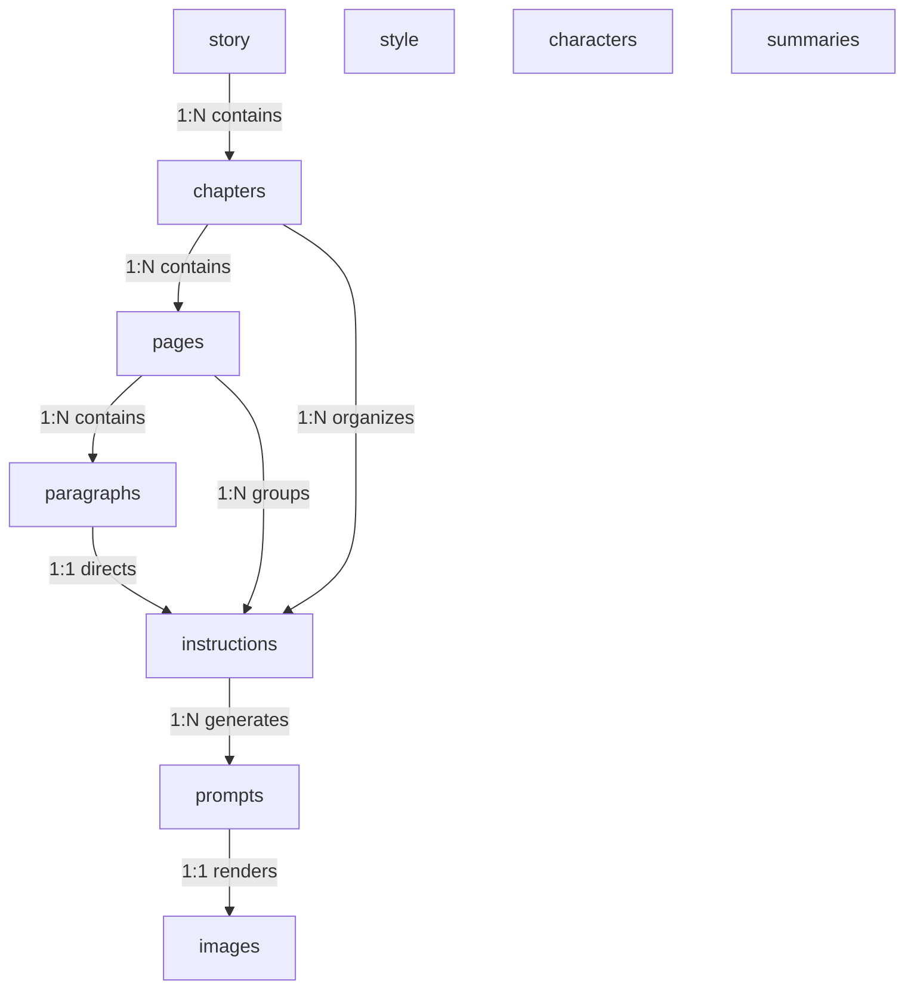

# WriteToSee Domain Model Specification

## Purpose & Architecture Overview

This document defines the core **Domain Entity Model** for the WriteToSee standalone application. 

The domain is formally specified as **SQL DDL (Data Definition Language)** with strict column alignment, explicit primary keys, composite sequence constraints, and comprehensive field-level `COMMENT ON COLUMN` documentation to provide a clear, unambiguous contract across all data models, constraints, and relationships.

### How the Domain Maps Across the Application Stack:
1. **TypeScript Interfaces:** Maps 1:1 to types defined in [`src/data/process/TYPES.ts`](file:///home/daniel/Data/GitHub/writetosee/writetosee-standalone-vite/src/data/process/TYPES.ts).
2. **IndexedDB Local Database:** Implemented via Dexie in [`src/data/process/db.ts`](file:///home/daniel/Data/GitHub/writetosee/writetosee-standalone-vite/src/data/process/db.ts) for offline-first caching and atomic state transactions.
3. **Local File Storage:** Serialized and synced to the user's local disk via the File System Access API:
   - Root Markdown documents: `story.md`, `style.md`, `characters.md`, `instructions.md`.
   - Asset directories: `images/{digest}.png`, `prompts/{digest}.md`, `summaries/{digest}.md`.
4. **Reactive State Sync:** Maintained in `@keldan-systems/state-mutex` memory stores (`story-data`, `style-data`, `characters-data`, `instructions-data`, `image-processing-status`) for real-time reactivity and multi-tab sync.

---

## Domain Data Types

- `_id`:      `UUID` or `TEXT` - Primary key for domain entities. 
- `_no`:      `INTEGER` - The sequential 1-based order in which the domain entity appears in the parent container. 
- `_title`:   `TEXT` - The display title of the domain entity. 
- `_text`:    `TEXT` - The full unsummarized raw text content of the domain entity. 
- `_summary`: `TEXT` - The LLM summary of the `_text` field. 
- `_digest`:  `TEXT` - The SHA256 / 64-bit hash of the `_text` or `_summary` field (summary if present and non-empty).

---

## Entity Relationship Overview

The DDL is ths source of truth, this is a simple overview of some of the relationships



---

## Domain Schema (SQL DDL)

## 1. Story Hierarchy
Represents the literary structure: Story -> Chapters -> Pages -> Paragraphs

```sql
CREATE TABLE story (
    story_id                   TEXT         PRIMARY KEY DEFAULT 'main',

    story_title                TEXT         NULL,
    story_text                 TEXT         NULL,
    story_summary              TEXT         NULL,
    story_digest               TEXT         NULL
);

COMMENT ON COLUMN story.story_id               IS 'Primary key: unique identifier for the active story singleton (defaults to "main").';
COMMENT ON COLUMN story.story_title            IS 'The title of the story that appears in the story header. Defaults to "Untitled Story".';
COMMENT ON COLUMN story.story_text             IS 'Complete concatenated text of all chapters in this story, in full unsummarized narrative.';
COMMENT ON COLUMN story.story_summary          IS 'All the text in story_text summarized by an LLM to a maximum of 400 words if story exceeds 1500 words.';
COMMENT ON COLUMN story.story_digest           IS 'The SHA256 hash of the story_text (or story_summary) for cache invalidation.';
```

```sql
CREATE TABLE chapters (
    chapter_no                 INTEGER      PRIMARY KEY DEFAULT (SELECT COALESCE(MAX(c.chapter_no), 0) + 1 FROM chapters c),

    story_id                   TEXT         NOT NULL REFERENCES story(story_id) ON DELETE CASCADE,

    chapter_title              TEXT         NOT NULL DEFAULT ('Chapter ' || (SELECT COALESCE(MAX(c.chapter_no), 0) + 1 FROM chapters c)),

    chapter_text               TEXT         NULL,
    chapter_summary            TEXT         NULL,
    chapter_digest             TEXT         NULL
);

COMMENT ON COLUMN chapters.chapter_no          IS 'Primary key: sequential 1-based order of the chapter in the story, auto-incrementing by 1.';
COMMENT ON COLUMN chapters.story_id            IS 'Foreign key reference to the parent story singleton.';
COMMENT ON COLUMN chapters.chapter_title       IS 'The title of the chapter. Defaults dynamically to "Chapter <chapter_no>".';
COMMENT ON COLUMN chapters.chapter_text        IS 'Complete concatenated text of all pages in this chapter, in full unsummarized.';
COMMENT ON COLUMN chapters.chapter_summary     IS 'All the text in chapter_text summarized by an LLM to a maximum of 250 words if chapter exceeds 500 words.';
COMMENT ON COLUMN chapters.chapter_digest      IS 'The SHA256 hash of the chapter_text field.';
```

```sql
CREATE TABLE pages (
    page_no                    INTEGER      PRIMARY KEY DEFAULT (SELECT COALESCE(MAX(p.page_no), 0) + 1 FROM pages p),

    chapter_no                 INTEGER      NOT NULL REFERENCES chapters(chapter_no) ON DELETE CASCADE,

    page_title                 TEXT         NOT NULL DEFAULT ('Page ' || (SELECT COALESCE(MAX(p.page_no), 0) + 1 FROM pages p WHERE p.chapter_no = chapter_no)),

    page_text                  TEXT         NULL,
    page_summary               TEXT         NULL,
    page_digest                TEXT         NULL,

    CONSTRAINT uq_pages_chapter_page_no UNIQUE (chapter_no, page_no)
);

CREATE UNIQUE INDEX idx_pages_chapter_page_no ON pages (chapter_no, page_no);

COMMENT ON COLUMN pages.page_no                IS 'Primary key: sequential 1-based order of the page across the story, auto-incrementing by 1.';
COMMENT ON COLUMN pages.chapter_no             IS 'Foreign key reference to the parent chapter_no.';
COMMENT ON COLUMN pages.page_title             IS 'The title of the page. Defaults dynamically to "Page <page_no>".';
COMMENT ON COLUMN pages.page_text              IS 'Complete concatenated text of all paragraphs in this page.';
COMMENT ON COLUMN pages.page_summary           IS 'Summary of page_text generated by LLM if page text exceeds 100 words; otherwise NULL.';
COMMENT ON COLUMN pages.page_digest            IS 'The SHA256 hash of the page_text field.';
```

```sql
CREATE TABLE paragraphs (
    paragraph_no               INTEGER      PRIMARY KEY DEFAULT (SELECT COALESCE(MAX(p.paragraph_no), 0) + 1 FROM paragraphs p),

    chapter_no                 INTEGER      NOT NULL REFERENCES chapters(chapter_no) ON DELETE CASCADE,
    page_no                    INTEGER      NOT NULL REFERENCES pages(page_no) ON DELETE CASCADE,

    paragraph_text             TEXT         NOT NULL,

    prior_text                 TEXT         NULL,
    preceding_text             TEXT         NULL,
    narrative_text             TEXT         NULL,
    narrative_summary          TEXT         NULL,
    narrative_digest           TEXT         NULL,

    CONSTRAINT uq_paragraphs_chapter_page_no UNIQUE (chapter_no, page_no, paragraph_no)
);

CREATE UNIQUE INDEX idx_paragraphs_chapter_page_no ON paragraphs (chapter_no, page_no, paragraph_no);

COMMENT ON COLUMN paragraphs.paragraph_no      IS 'Primary key: sequential 1-based order of the paragraph across the story, auto-incrementing by 1.';
COMMENT ON COLUMN paragraphs.chapter_no        IS 'Foreign key reference to the parent chapter_no.';
COMMENT ON COLUMN paragraphs.page_no           IS 'Foreign key reference to the parent page_no.';
COMMENT ON COLUMN paragraphs.paragraph_text    IS 'The original narrative text sentence or paragraph in the story.';
COMMENT ON COLUMN paragraphs.prior_text        IS 'Accumulated paragraph text on this page preceding this paragraph.'; 
COMMENT ON COLUMN paragraphs.preceding_text    IS 'Accumulated summaries for all preceding chapters, and summaries for all preceding pages in the current chapter.';
COMMENT ON COLUMN paragraphs.narrative_text    IS 'Concatenation of preceding_text + prior_text.';
COMMENT ON COLUMN paragraphs.narrative_summary IS 'Preceding context followed by prior text, compressed through LLM if total context exceeds 500 words.';
COMMENT ON COLUMN paragraphs.narrative_digest  IS 'The SHA256 hash of the narrative_summary field for prompt cache lookup.';
```

 
## 2. Visual Style & Global Rendering Instructions
Configuration for global art style presets, reference URLs, and prompt guidance

```sql
CREATE TABLE style (
    story_id                   TEXT         PRIMARY KEY DEFAULT 'main' REFERENCES story(story_id) ON DELETE CASCADE,

    drawing_instructions       TEXT         NOT NULL DEFAULT '',
    panel_per_paragraph        BOOLEAN      NOT NULL DEFAULT TRUE,
    reference_url              TEXT         DEFAULT '',
    reference_instructions     TEXT         DEFAULT '',
    use_reference_instructions BOOLEAN      NOT NULL DEFAULT TRUE,
);

COMMENT ON COLUMN style.story_id               IS 'Primary key: unique identifier for the active project style configuration referencing story(story_id).';
COMMENT ON COLUMN style.drawing_instructions   IS 'Global artistic medium, rendering directives, color palette, and lighting rules.';
COMMENT ON COLUMN style.panel_per_paragraph    IS 'Flag determining whether each paragraph generates a separate image panel.';
COMMENT ON COLUMN style.reference_url          IS 'URL or file path to an artist sample or visual reference image.';
COMMENT ON COLUMN style.reference_instructions IS 'Detailed visual descriptors and prompt modifiers derived from the reference image.';
COMMENT ON COLUMN style.use_reference_instructions IS 'Flag to automatically inject reference instructions into image generation prompts.';
```

## 3. Characters & Entity Registry
Extracted character roster with visual appearance traits and instructions

```sql
CREATE TABLE characters (
    character_name             TEXT         PRIMARY KEY,
    
    character_no               INTEGER      NULL,
    reference_url              TEXT         DEFAULT '',
    crop_box                   TEXT         NULL,
    crop_x                     REAL         NULL,
    crop_y                     REAL         NULL,
    crop_width                 REAL         NULL,
    crop_height                REAL         NULL,
    description_text           TEXT         NOT NULL DEFAULT '',
    instructions_text          TEXT         NOT NULL DEFAULT ''
);

COMMENT ON COLUMN characters.character_name    IS 'Unique canonical name of the character (case-insensitive index). Names may contain ampersands and commas.';
COMMENT ON COLUMN characters.character_no      IS 'Sequential 1-based order of the character in the roster.';
COMMENT ON COLUMN characters.reference_url     IS 'Reference portrait URL or image path for facial and costume consistency.';
COMMENT ON COLUMN characters.crop_box          IS 'JSON string or object containing normalized bounding box coordinates { x, y, width, height } (0.0 to 1.0) used to isolate the character in the reference image for vision analysis.';
COMMENT ON COLUMN characters.crop_x            IS 'Normalized horizontal start coordinate (0.0 to 1.0) of bounding box for character analysis.';
COMMENT ON COLUMN characters.crop_y            IS 'Normalized vertical start coordinate (0.0 to 1.0) of bounding box for character analysis.';
COMMENT ON COLUMN characters.crop_width        IS 'Normalized width (0.0 to 1.0) of bounding box for character analysis.';
COMMENT ON COLUMN characters.crop_height       IS 'Normalized height (0.0 to 1.0) of bounding box for character analysis.';
COMMENT ON COLUMN characters.description_text  IS 'Detailed visual description of physical appearance, age, clothing, and features.';
COMMENT ON COLUMN characters.instructions_text IS 'Specific rendering and character prompt directives injected when this character appears.';
```

## 4. Panel Instructions (Scene Directives & Locking)
Per-panel composition rules, character assignment, camera angles, and lock states

```sql 
CREATE TABLE instructions (
    chapter_no                 INTEGER      NOT NULL REFERENCES chapters(chapter_no) ON DELETE CASCADE,
    page_no                    INTEGER      NOT NULL REFERENCES pages(page_no) ON DELETE CASCADE,
    paragraph_no               INTEGER      NOT NULL REFERENCES paragraphs(paragraph_no) ON DELETE CASCADE,

    cinematographic_directions TEXT         NULL,
    is_locked                  BOOLEAN      NULL,
    assigned_characters        TEXT         NULL,
    assigned_prompt_digests    TEXT         NULL,   
    current_prompt_digest      TEXT         NULL,

    PRIMARY KEY (chapter_no, page_no, paragraph_no)
);

COMMENT ON COLUMN instructions.chapter_no                 IS 'Composite primary key & foreign key: chapter number of this panel.';
COMMENT ON COLUMN instructions.page_no                    IS 'Composite primary key & foreign key: page number of this panel.';
COMMENT ON COLUMN instructions.paragraph_no               IS 'Composite primary key & foreign key: sequential paragraph number of this panel.';
COMMENT ON COLUMN instructions.cinematographic_directions IS 'Camera angle, shot type (wide, close-up), mood, and composition directives for this scene.';
COMMENT ON COLUMN instructions.is_locked                  IS 'Lock flag preventing automated prompt regeneration when story text changes.';
COMMENT ON COLUMN instructions.assigned_characters        IS 'JSON array of character names actively present in this panel.';
COMMENT ON COLUMN instructions.assigned_prompt_digests    IS 'JSON array of prompt digests assigned to this panel.';
COMMENT ON COLUMN instructions.current_prompt_digest      IS 'SHA256 hash of the currently active prompt for this panel.';
```

## 5. Illustrations & Image Generation Artifacts
Generated images, visual prompts, and completion status

```sql
CREATE TABLE images (
    image_digest               TEXT         PRIMARY KEY,

    image_status               TEXT         NOT NULL CHECK (image_status IN ('PROCESSING', 'SAVED', 'FAILED')),

    created_at                 TIMESTAMP    DEFAULT CURRENT_TIMESTAMP
);

COMMENT ON COLUMN images.image_digest          IS 'Primary key: deterministic SHA256 digest of the combined prompt text matching prompts.prompt_digest.';
COMMENT ON COLUMN images.image_status          IS 'Current generation lifecycle state: PROCESSING, SAVED, or FAILED.';
COMMENT ON COLUMN images.created_at            IS 'Timestamp when this image file was generated and saved to disk.';
```

## 6. Caches (LLM Prompts & Narrative Summaries)
Reusable prompt text files and chapter/page narrative summaries

```sql
CREATE TABLE prompts (
    prompt_digest              TEXT         PRIMARY KEY,

    prompt_text                TEXT         NOT NULL,
 
    style_text                 TEXT         NOT NULL,
    cinematographic_text       TEXT         NOT NULL,
    character_text             TEXT         NOT NULL,
    narrative_text             TEXT         NOT NULL,
    scene_text                 TEXT         NOT NULL
);

COMMENT ON COLUMN prompts.prompt_digest        IS 'Primary key: deterministic SHA256 digest of the compiled prompt components.';
COMMENT ON COLUMN prompts.prompt_text          IS 'Complete compiled prompt text sent to the LLM / image generation endpoint.';
COMMENT ON COLUMN prompts.style_text           IS 'Rendered style modifier segment included in the prompt.';
COMMENT ON COLUMN prompts.cinematographic_text IS 'Camera and lighting directive segment included in the prompt.';
COMMENT ON COLUMN prompts.character_text       IS 'Character visual trait descriptors included in the prompt.';
COMMENT ON COLUMN prompts.narrative_text       IS 'Preceding narrative summary context included in the prompt.';
COMMENT ON COLUMN prompts.scene_text           IS 'Immediate scene action text included in the prompt.';
```

```sql
CREATE TABLE summaries (
    summary_digest             TEXT         PRIMARY KEY,

    summary_text               TEXT         NOT NULL
);

COMMENT ON COLUMN summaries.summary_digest     IS 'Primary key: deterministic digest of the source text that was summarized.';
COMMENT ON COLUMN summaries.summary_text       IS 'Cached narrative summary produced by the LLM.';
```
