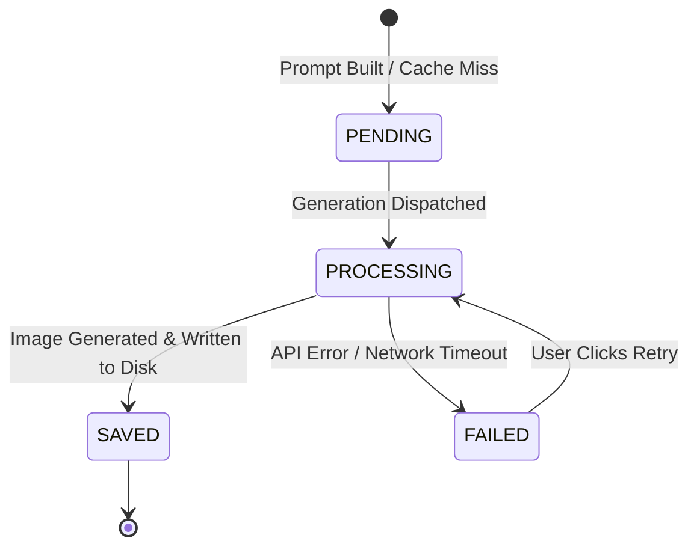

# WriteToSee Edge Cases, System Boundaries & Error Recovery

This document details common runtime edge cases, browser API nuances, fallback behaviors, and error recovery workflows in WriteToSee.

---

## 1. File System Access API & Directory Handles

### Permission Persistence & Re-Authorization
* The browser's File System Access API does not permanently preserve read/write authorization across browser restarts.
* The `FileSystemDirectoryHandle` is stored in IndexedDB (`WriteToSeeFileStorageDB`), but upon reload the browser requires an explicit user gesture (`verifyPermission()`) to re-grant access.
* **Failure Mode:** Attempting to read/write before user interaction throws `NotAllowedError`.
* **Recovery:** When permission is not yet granted, render the `FolderConnector` UI prompt allowing the user to click "Reconnect Folder".

### Sequential Write Queue
* Concurrent `writeFile` operations on Chromium can cause race conditions or leave locked temporary `.crswap` files.
* **Solution:** All disk writes are piped through a sequential promise queue in `src/data/storage/fileStorage.ts` (`writeQueue`).

---

## 2. Story Hierarchy & Markdown Fallback Rules

### Unformatted or Flat `story.md`
* If `story.md` contains plain text without markdown headings (`#`, `##`, `###`):
  * `story_title` defaults to `"Untitled Story"`.
  * `chapters` array creates a single default `Chapter 1` (`chapter_no: 0`).
  * `pages` array inside Chapter 1 creates a single default `Page 1` (`page_no: 0`).
  * Text paragraphs are parsed by splitting double newlines (`\n\n`) and assigned sequential `paragraph_no` indices.

### Empty or Corrupted Files
* If `style.md` is empty or missing, fallback to default illustration styles defined in `parsers.ts`.
* If `characters.md` is missing, initialize an empty roster without throwing errors.
* If `instructions.md` is missing, the ingestion pipeline automatically synthesizes default unlocked instruction records for all parsed paragraphs.

---

## 3. Character Names with Special Characters

* Characters may have names containing spaces, commas, ampersands, or accents (e.g. *"Alice & Bob"*, *"Dr. Smith, Jr."*).
* **Tag Matching:** In `instructions.md`, assigned characters are stored as JSON arrays or comma-delimited strings.
* **ID Generation:** `character_id` is assigned a unique generated ID (e.g. `char_0_1716123456789`), while `character_name` retains the exact human-readable string.

---

## 4. Image Generation Lifecycle & Failure Handling

### Handling Failures
1. If the image model API fails or times out, write `{ image_digest, image_status: 'FAILED' }` to Dexie `processDb.images`.
2. The UI detects `image_status === 'FAILED'` and displays a retry badge/button.
3. The prompt digest and prompt file remain cached, allowing immediate re-submission without re-compiling text.

---

## 5. Cache Invalidation & Cache Reset (`clearCaches.ts`)

* To reset cached calculations without destroying user markdown documents:
  * Clear Dexie `images`, `prompts`, and `summaries` tables.
  * User-authored data in `story`, `style`, `characters`, and `instructions` is preserved.
  * Ingestion / compilation pipeline re-evaluates all prompts and generates fresh digests.
