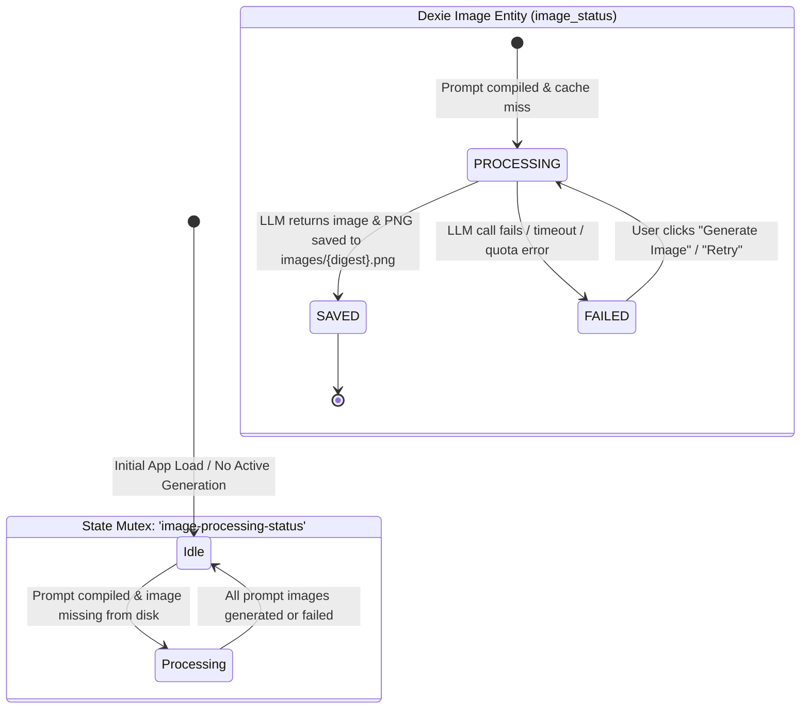

# WriteToSee States & Storage Specification

## Purpose & Architecture Overview

This document specifies the complete **State Architecture, Dexie IndexedDB Schema, `@keldan-systems/state-mutex` State Keys, and Lifecycle Transitions** for the WriteToSee standalone application.

In accordance with WriteToSee state partitioning rules:
1. **Domain Data State:** Managed exclusively via **Dexie.js IndexedDB** (`WriteToSeeProcessDB`) with reactive `useLiveQuery` subscriptions for all domain entities.
2. **Display & Transient UI State:** Managed via **`@keldan-systems/state-mutex`** (`useLocalState`, `useSharedState`, `setState`) for cross-tab reactivity and user display preferences.

---

## 1. Image State Architecture (Single Image State Pipeline)

WriteToSee maintains a single unified image generation state pipeline partitioned between Dexie IndexedDB and `@keldan-systems/state-mutex`:

### A. The Single Image State Mutex: `image-processing-status`
* **Key:** `'image-processing-status'`
* **Type:** `'idle' | 'processing'`
* **Persistence:** `StoragePersistence.local` (`localStorage` + cross-tab mutex event dispatch)
* **Purpose:** Global indicator tracking whether background LLM image generation is currently in flight.
* **Transitions:**
  - Set to `'processing'` when `processImages()` starts generating illustrations for uncached prompts.
  - Set to `'idle'` when all missing images have finished generating (or on completion/error).
  - Listened to by `MainLayout.tsx` (to display the "Generating Images" animated badge in the navbar) and `PanelImageDisplay.tsx` (to display loading overlays on pending panels).

### B. Dexie Image Entity State: `images` Table
* **Table:** `processDb.images`
* **Primary Key:** `image_digest` (Deterministic SHA256 of compiled 5-segment prompt)
* **Field:** `image_status`
* **Allowed Values:** `'PROCESSING' | 'SAVED' | 'FAILED'`
* **Reactivity:** Subscribed via `useLiveQuery(() => processDb.images.toArray())`.



---

## 2. Dexie IndexedDB Schema (`WriteToSeeProcessDB`)

Database name: `WriteToSeeProcessDB` (Version 3)  
Source file: [`src/data/process/db.ts`](file:///home/daniel/Data/GitHub/writetosee/writetosee-standalone-vite/src/data/process/db.ts)

### Table Index Definitions

```typescript
this.version(3).stores({
  story: 'story_id, id',
  chapters: 'chapter_no, story_id',
  pages: 'page_no, chapter_no, [chapter_no+page_no]',
  paragraphs: 'paragraph_no, chapter_no, page_no, [chapter_no+page_no+paragraph_no]',
  style: 'story_id, id',
  characters: 'character_id, character_no, character_name, name',
  instructions: 'paragraph_no, instructionNo, [chapter_no+page_no+paragraph_no], current_prompt_digest',
  images: 'image_digest, image_status, created_at',
  prompts: 'prompt_digest, digest',
  summaries: 'summary_digest, digest, summaryId'
});
```

### Table Specifications

| Table | Primary Key | Secondary Indexes | Description |
| :--- | :--- | :--- | :--- |
| **`story`** | `story_id` (default: `'main'`) | `id` | Singleton record storing title, concatenated story text, summary, and digest. |
| **`chapters`** | `chapter_no` | `story_id` | Sequential chapter entities with titles, chapter text, and chapter summaries. |
| **`pages`** | `page_no` | `chapter_no`, `[chapter_no+page_no]` | Sequential page entities within chapters. |
| **`paragraphs`** | `paragraph_no` | `chapter_no`, `page_no`, `[chapter_no+page_no+paragraph_no]` | Individual narrative text sentences/blocks with prior, preceding, and narrative context summaries. |
| **`style`** | `story_id` (default: `'main'`) | `id` | Global drawing instructions, artist reference image URL, reference prompt descriptors. |
| **`characters`** | `character_id` | `character_no`, `character_name`, `name` | Character roster with descriptions, drawing directives, reference portrait paths, and crop boxes. |
| **`instructions`** | `paragraph_no` | `instructionNo`, `[chapter_no+page_no+paragraph_no]`, `current_prompt_digest` | Per-panel scene composition directives, assigned character tags, assigned prompt history, lock state. |
| **`images`** | `image_digest` | `image_status`, `created_at` | Generated illustration state: `'PROCESSING' \| 'SAVED' \| 'FAILED'`. |
| **`prompts`** | `prompt_digest` | `digest` | Compiled 5-segment prompt text cache keyed by SHA256 digest. |
| **`summaries`** | `summary_digest` | `digest`, `summaryId` | LLM-generated narrative summary cache keyed by SHA256 digest of uncompressed source text. |

---

## 3. `@keldan-systems/state-mutex` Key Registry

The `@keldan-systems/state-mutex` store manages ephemeral UI state, operation locks, and cross-tab synchronization.

### Complete State Mutex Keys Matrix

| Key | Type | Persistence | Description | Components / Workflows |
| :--- | :--- | :--- | :--- | :--- |
| **`image-processing-status`** | `'idle' \| 'processing'` | `StoragePersistence.local` | **Single Image State:** Tracks active LLM image generation across tabs. | `processImages`, `loadStartup`, `MainLayout`, `PanelImageDisplay`, `clearCaches` |
| **`writetosee-theme`** | `'pastel' \| 'dim'` | `StoragePersistence.local` | Selected UI theme (Pastel light vs Dim dark). | `MainLayout` |
| **`writetosee-columns-per-row`** | `number` (1–12) | `StoragePersistence.local` | Grid column density for comic/story panels. | `MainLayout`, `Story` |
| **`isDEBUG`** | `boolean` | `StoragePersistence.local` | Toggle for debug UI (view prompt, costs, logs, images menu). | `MainLayout`, `About`, `Story`, `Images`, `PanelImageDisplay` |
| **`safeMode`** | `boolean` | `StoragePersistence.local` | Simple mode toggle (restricts navigation to Story only). | `MainLayout`, `About` |
| **`process-startup-loading`** | `boolean` | `StoragePersistence.none` | True while directory files are being ingested on load. | `loadStartup`, `Story`, `clearCaches` |
| **`process-startup-error`** | `string \| null` | `StoragePersistence.none` | Error message if startup ingestion fails. | `loadStartup`, `clearCaches` |
| **`story-loading`** | `boolean` | `StoragePersistence.none` | True while saving `story.md` and updating database. | `saveStory`, `MainLayout` |
| **`story-error`** | `string \| null` | `StoragePersistence.none` | Error message if story save fails. | `saveStory` |
| **`story-hash`** | `string` | `StoragePersistence.local` | SHA256 digest of `story.md` for cross-tab dirty check. | `saveStory`, `loadStartup`, `clearCaches` |
| **`story-data`** | `Story` | `StoragePersistence.none` | In-memory parsed story object cache. | `saveStory`, `loadStartup`, `clearCaches` |
| **`style-loading`** | `boolean` | `StoragePersistence.none` | True while saving `style.md` and updating database. | `saveStyle` |
| **`style-error`** | `string \| null` | `StoragePersistence.none` | Error message if style save fails. | `saveStyle` |
| **`style-hash`** | `string` | `StoragePersistence.local` | SHA256 digest of `style.md` for cross-tab dirty check. | `saveStyle`, `loadStartup`, `Style`, `clearCaches` |
| **`style-data`** | `Style` | `StoragePersistence.none` | In-memory parsed style object cache. | `saveStyle`, `loadStartup`, `Style`, `clearCaches` |
| **`characters-loading`** | `boolean` | `StoragePersistence.none` | True while saving `characters.md` and updating database. | `saveCharacters` |
| **`characters-error`** | `string \| null` | `StoragePersistence.none` | Error message if characters save fails. | `saveCharacters` |
| **`characters-hash`** | `string` | `StoragePersistence.local` | SHA256 digest of `characters.md` for cross-tab dirty check. | `saveCharacters`, `loadStartup`, `Characters`, `clearCaches` |
| **`characters-data`** | `Character[]` | `StoragePersistence.none` | In-memory parsed characters array cache. | `saveCharacters`, `loadStartup`, `Characters`, `PanelInstructionsModal`, `clearCaches` |
| **`instructions-loading`** | `boolean` | `StoragePersistence.none` | True while saving `instructions.md` and updating database. | `saveInstructions` |
| **`instructions-error`** | `string \| null` | `StoragePersistence.none` | Error message if instructions save fails. | `saveInstructions` |
| **`instructions-hash`** | `string` | `StoragePersistence.local` | SHA256 digest of `instructions.md` for cross-tab sync. | `saveInstructions`, `loadStartup`, `clearCaches` |
| **`instructions-data`** | `Instruction[]` | `StoragePersistence.none` | In-memory parsed instructions array cache. | `saveInstructions`, `loadStartup`, `processImages`, `clearCaches` |

---

## 4. State Synchronization & React Integration

### Domain Reactivity (`useLiveQuery`)
Components subscribing to domain data (such as `Story.tsx`, `Images.tsx`, `Characters.tsx`, `Style.tsx`) use Dexie `useLiveQuery`:

```typescript
import { useLiveQuery } from 'dexie-react-hooks';
import { processDb } from '@/data/process/db';

// Reactive subscription to domain entities
const story = useLiveQuery(() => processDb.story.get('main'));
const paragraphs = useLiveQuery(() => processDb.paragraphs.toArray()) ?? [];
const instructions = useLiveQuery(() => processDb.instructions.toArray()) ?? [];
const images = useLiveQuery(() => processDb.images.toArray()) ?? [];
```

### UI & Display State (`useLocalState`)
Components subscribing to display settings or the image generation mutex use `@keldan-systems/state-mutex`:

```typescript
import { useLocalState } from '@keldan-systems/state-mutex';

// Subscribing to the single image processing state mutex
const [imageProcessingStatus] = useLocalState<'idle' | 'processing'>('image-processing-status', 'idle');

// Subscribing to layout and theme preferences
const [columnsPerRow, setColumnsPerRow] = useLocalState<number>('writetosee-columns-per-row', 2);
const [theme, setTheme] = useLocalState<string>('writetosee-theme', 'pastel');
const [isDEBUG] = useLocalState<boolean>('isDEBUG', false);
```

### Cache Invalidation & Directory Reset (`clearAllCaches`)
When disconnecting or switching directory handles, all Dexie tables and state mutex keys are atomically cleared:

```typescript
import { clearAllCaches } from '@/data/clearCaches';

// Clears all Dexie tables and resets all state-mutex stores to initial values
await clearAllCaches();
```
