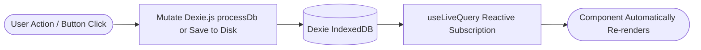

# WriteToSee UI Architecture & Component Guidelines

This document outlines the frontend engineering patterns, React architectural standards, routing conventions, and reactive mutation workflows for the WriteToSee standalone React application.

---

## 1. Route Architecture (Three-File Pattern)

All route views in `src/routes/` follow a modular three-file separation of concerns:

```text
src/routes/
├── Story.tsx           # React UI Component (presentation & user event bindings)
├── Story.loader.ts     # Route data loader (pre-fetching, route validation, params)
└── Story.action.ts     # Form actions / route-level mutations
```

### Routing Rules
1. **`*.loader.ts`**: Handles pre-conditions before the route renders (e.g. checking if a directory is connected or loading initial metadata).
2. **`*.action.ts`**: Encapsulates discrete route form actions or submission mutations.
3. **`*.tsx`**: Subscribes directly to live domain state via Dexie `useLiveQuery` and binds user interactions.

---

## 2. Component Scaffolding (`DefaultComponent.tsx` Pattern)

Every new React component MUST use `src/components/DefaultComponent.tsx` as its foundational template:

```tsx
import type { HTMLAttributes, PropsWithChildren } from "react";

export interface MyComponentProps extends HTMLAttributes<HTMLDivElement>, PropsWithChildren {
  // Add component-specific props here
  title?: string;
}

export function MyComponent({
  children,
  className = "",
  title,
  ...props
}: MyComponentProps) {
  return (
    <div
      data-name="MyComponent"
      className={`my-component ${className}`}
      {...props}
    >
      {title && <h3>{title}</h3>}
      {children}
    </div>
  );
}
```

### Component Rules
* **`data-name` Attribute:** Mandatory on the root element of every component for consistent DOM inspection, testing, and debugging.
* **Prop Forwarding:** Always extend `HTMLAttributes<T>` and `PropsWithChildren` to ensure natural HTML event handlers (`onClick`, `onKeyDown`, `aria-*`, etc.) and CSS classes pass through.
* **Vanilla CSS / CSS Modules:** Use clean CSS or existing utility classes. Never introduce external CSS utility frameworks unless explicitly requested.

---

## 3. Reactive State & Unidirectional Mutation Flow

Never duplicate Dexie domain models into local React `useState` or `useReducer`. 



### Anti-Pattern vs. Correct Pattern

```tsx
// ❌ ANTI-PATTERN: Copying IndexedDB data into local useState
function BadStoryView() {
  const [chapters, setChapters] = useState([]);
  useEffect(() => {
    processDb.chapters.toArray().then(setChapters); // Breaks reactivity on background DB updates!
  }, []);
  return <div>{chapters.map(...)}</div>;
}

// ✅ CORRECT PATTERN: Reactive Live Query
import { useLiveQuery } from 'dexie-react-hooks';
import { processDb } from '../data/process/db';

function GoodStoryView() {
  const chapters = useLiveQuery(() => processDb.chapters.toArray()) ?? [];
  return <div>{chapters.map(...)}</div>;
}
```

---

## 4. Transient UI State (`@keldan-systems/state-mutex`)

Transient display states (such as active tab, panel zoom, sidebar collapse, or column layout) MUST use `@keldan-systems/state-mutex`:

* **`useLocalState<T>(key: string, defaultValue: T)`**: Persisted in browser `localStorage` and synchronized across multiple open browser tabs.
* **`useSharedState<T>(key: string, defaultValue: T)`**: In-memory ephemeral shared state across component trees.

```tsx
import { useLocalState } from '@keldan-systems/state-mutex';

export function PanelGridSettings() {
  const [columns, setColumns] = useLocalState<number>('panel-columns', 3);
  const [zoomLevel, setZoomLevel] = useLocalState<number>('panel-zoom', 100);

  return (
    <div data-name="PanelGridSettings">
      <button onClick={() => setColumns(2)}>2 Columns</button>
      <button onClick={() => setColumns(4)}>4 Columns</button>
    </div>
  );
}
```

---

## 5. Modal & Overlay Patterns

Modals (e.g. `ImageCropModal`, `PanelInstructionsModal`, `DisclaimerModal`) follow standard lifecycle rules:
1. Controlled via boolean visibility props or state mutex keys.
2. Render backdrop overlays with accessible focus management (`aria-modal="true"`, `role="dialog"`).
3. Provide explicit `onClose` callbacks and clean up temporary object URLs on unmount.
